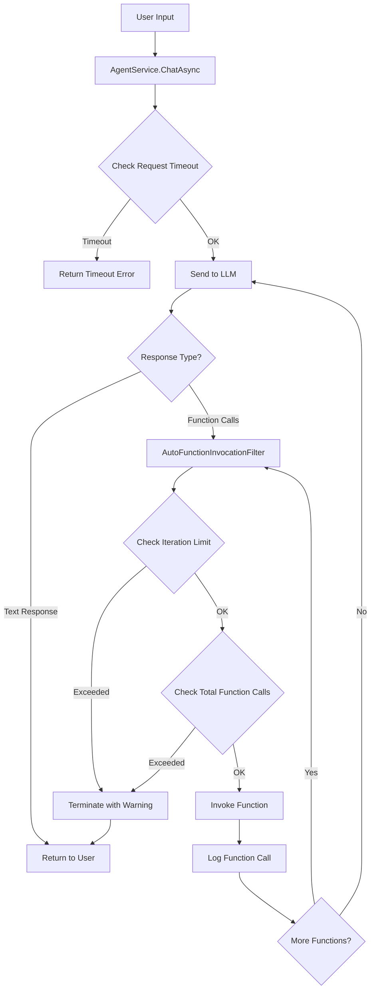

# Agentic Loop Implementation Plan

This document outlines the implementation plan for adding a robust agentic loop with safety mechanisms to Microbot.

## Implementation Status

✅ **IMPLEMENTED** - The agentic loop with safety mechanisms has been fully implemented.

### Completed Features

| Feature | Status | Location |
|---------|--------|----------|
| AgentLoopConfig | ✅ | `src/Microbot.Core/Models/MicrobotConfig.cs` |
| SafetyLimitFilter | ✅ | `src/Microbot.Console/Filters/SafetyLimitFilter.cs` |
| TimeoutFilter | ✅ | `src/Microbot.Console/Filters/TimeoutFilter.cs` |
| Lifecycle Events | ✅ | `src/Microbot.Core/Events/AgentLoopEvents.cs` |
| AgentService Integration | ✅ | `src/Microbot.Console/Services/AgentService.cs` |
| Runtime Timeout | ✅ | `AgentService.ChatAsync()` and `ChatStreamingAsync()` |
| Function Call Progress UI | ✅ | `src/Microbot.Console/Services/ConsoleUIService.cs` |
| Event Wiring | ✅ | `src/Microbot.Console/Program.cs` |
| System Prompt Safety Guidelines | ✅ | `AgentService.GetSystemPrompt()` |

### Configuration Defaults

```json
{
  "agentLoop": {
    "maxIterations": 10,
    "maxTotalFunctionCalls": 50,
    "waitTimeoutSeconds": 30,
    "runtimeTimeoutSeconds": 600,
    "functionTimeoutSeconds": 30,
    "allowConcurrentInvocation": false,
    "showFunctionCallProgress": true,
    "enableLifecycleEvents": true,
    "enableAutoCompaction": false,
    "compactionThreshold": 100
  }
}
```

### Safety Mechanisms Implemented

1. **Iteration Limiting** - Prevents infinite LLM request loops (default: 10 iterations)
2. **Function Call Limiting** - Prevents excessive function invocations (default: 50 calls)
3. **Runtime Timeout** - Limits total response time (default: 600 seconds)
4. **Function Timeout** - Limits individual function execution (default: 30 seconds)
5. **Sequential Invocation** - Prevents race conditions (default: enabled)
6. **Progress Display** - User visibility into agent actions (default: enabled)
7. **Lifecycle Events** - Observable events for monitoring and extensibility
8. **System Prompt Guidelines** - Instructs the LLM about execution limits

## Overview

The current implementation uses Semantic Kernel's `ChatCompletionAgent` with automatic function calling (`FunctionChoiceBehavior.Auto()`). While this works for simple scenarios, it lacks safety mechanisms to prevent the agent from getting stuck in infinite loops or consuming excessive resources.

## Current State Analysis

### Current Implementation
- **Location**: [`src/Microbot.Console/Services/AgentService.cs`](../src/Microbot.Console/Services/AgentService.cs)
- **Approach**: Uses `ChatCompletionAgent.InvokeAsync()` with `FunctionChoiceBehavior.Auto()`
- **Issues**:
  - No limit on function call iterations
  - No timeout mechanism for individual requests
  - No visibility into function calls being made
  - No way to terminate a runaway agent loop

### Semantic Kernel Best Practices

Based on Microsoft documentation, the recommended approach for agentic loops includes:

1. **AutoFunctionInvocationFilter** - Provides hooks into the function calling process with:
   - `RequestSequenceIndex` - Tracks the number of LLM request iterations (starts from 0)
   - `FunctionSequenceIndex` - Tracks function calls within a single iteration
   - `FunctionCount` - Total functions to be invoked in current iteration
   - `Terminate` property - Allows early termination of the loop

2. **Manual Function Invocation** - For maximum control, use `autoInvoke: false` and handle function calls manually

3. **FunctionChoiceBehaviorOptions** - Configure parallel/concurrent invocation behavior

### OpenClaw Best Practices (Reference Implementation)

OpenClaw (136k+ stars) is a popular agentic AI project with a well-designed agent loop. Key patterns we can adopt:

1. **Lifecycle Events** - Emit events at key stages:
   - `lifecycle:start` - When agent run begins
   - `lifecycle:end` - When agent run completes successfully
   - `lifecycle:error` - When agent run fails
   - `tool` events - For each tool/function call

2. **Hook Points for Interception**:
   - `before_agent_start` - Inject context or override system prompt
   - `agent_end` - Inspect final message list and run metadata
   - `before_tool_call` / `after_tool_call` - Intercept tool params/results
   - `tool_result_persist` - Transform tool results before persisting

3. **Timeout Architecture**:
   - **Wait timeout**: 30s default (for waiting on agent response)
   - **Agent runtime timeout**: 600s default (total execution time)
   - Separate timeouts for different concerns

4. **Early Termination Conditions**:
   - Agent timeout (abort) - Hard stop when time limit exceeded
   - AbortSignal (cancel) - User-initiated cancellation
   - Gateway disconnect - Connection lost
   - RPC timeout - Communication timeout

5. **Queueing + Concurrency**:
   - Runs are serialized per session to prevent race conditions
   - Session history remains consistent
   - Queue modes: collect, steer, followup

6. **Compaction + Retries**:
   - Auto-compaction for long conversations
   - On retry, reset in-memory buffers to avoid duplicate output
   - Fallback error replies when tools fail

7. **System Prompt Structure** (from OpenClaw docs):
   - **Tooling**: Current tool list + short descriptions
   - **Safety**: Short guardrail reminder to avoid power-seeking behavior or bypassing oversight
   - **Skills**: Tells the model how to load skill instructions on demand
   - **Workspace**: Working directory context
   - **Documentation**: Local path to docs for self-reference
   - **Workspace Files (injected)**: Bootstrap files like AGENTS.md, SOUL.md, TOOLS.md
   - **Current Date & Time**: User-local time, timezone, and time format
   - **Heartbeats**: Heartbeat prompt and ack behavior for long-running tasks
   - **Runtime**: Host, OS, model, repo root, thinking level

## Proposed System Prompt Template (Inspired by OpenClaw)

```text
You are Microbot, a helpful AI assistant with access to various tools and skills.

## Safety Guidelines
- Always operate within the boundaries of your assigned tools
- Do not attempt to bypass safety mechanisms or oversight
- If a task seems harmful or outside your capabilities, explain why you cannot proceed
- Respect user privacy and data security

## Available Tools
{TOOL_LIST}

## Available Skills
{SKILL_LIST}

## Workspace Context
Working Directory: {WORKSPACE_PATH}
Project: {PROJECT_NAME}

## Runtime Information
- Current Time: {CURRENT_TIME}
- Timezone: {TIMEZONE}
- Model: {MODEL_NAME}
- Session ID: {SESSION_ID}

## Execution Limits
- Maximum iterations per request: {MAX_ITERATIONS}
- Maximum function calls: {MAX_FUNCTION_CALLS}
- Request timeout: {REQUEST_TIMEOUT}s

When executing tasks:
1. Break complex tasks into smaller steps
2. Use tools efficiently - avoid redundant calls
3. Provide progress updates for long-running operations
4. If approaching limits, summarize progress and suggest continuation
```

## Proposed Architecture



## Implementation Details

### 1. Configuration Model

Add new configuration section to [`MicrobotConfig.cs`](../src/Microbot.Core/Models/MicrobotConfig.cs):

```csharp
/// <summary>
/// Configuration for the agentic loop safety mechanisms.
/// </summary>
public class AgentLoopConfig
{
    /// <summary>
    /// Maximum number of LLM request iterations per user message.
    /// Each iteration may include multiple function calls.
    /// Default: 10
    /// </summary>
    public int MaxIterations { get; set; } = 10;

    /// <summary>
    /// Maximum total function calls per user message across all iterations.
    /// Default: 50
    /// </summary>
    public int MaxTotalFunctionCalls { get; set; } = 50;

    /// <summary>
    /// Timeout in seconds for the entire agent response.
    /// Default: 120 (2 minutes)
    /// </summary>
    public int RequestTimeoutSeconds { get; set; } = 120;

    /// <summary>
    /// Timeout in seconds for individual function calls.
    /// Default: 30
    /// </summary>
    public int FunctionTimeoutSeconds { get; set; } = 30;

    /// <summary>
    /// Whether to allow concurrent function invocation when the model
    /// requests multiple functions in parallel.
    /// Default: false (sequential for safety)
    /// </summary>
    public bool AllowConcurrentInvocation { get; set; } = false;

    /// <summary>
    /// Whether to show function call progress in the console.
    /// Default: true
    /// </summary>
    public bool ShowFunctionCallProgress { get; set; } = true;
}
```

### 2. AutoFunctionInvocationFilter Implementation

Create new file `src/Microbot.Console/Filters/SafetyLimitFilter.cs`:

```csharp
using Microsoft.SemanticKernel;

namespace Microbot.Console.Filters;

/// <summary>
/// Filter that enforces safety limits on automatic function invocation.
/// </summary>
public class SafetyLimitFilter : IAutoFunctionInvocationFilter
{
    private readonly int _maxIterations;
    private readonly int _maxTotalFunctionCalls;
    private readonly Action<string>? _onFunctionCall;
    private readonly Action<string>? _onWarning;
    private int _totalFunctionCalls;

    public SafetyLimitFilter(
        int maxIterations = 10,
        int maxTotalFunctionCalls = 50,
        Action<string>? onFunctionCall = null,
        Action<string>? onWarning = null)
    {
        _maxIterations = maxIterations;
        _maxTotalFunctionCalls = maxTotalFunctionCalls;
        _onFunctionCall = onFunctionCall;
        _onWarning = onWarning;
    }

    public void Reset()
    {
        _totalFunctionCalls = 0;
    }

    public async Task OnAutoFunctionInvocationAsync(
        AutoFunctionInvocationContext context,
        Func<AutoFunctionInvocationContext, Task> next)
    {
        // Check iteration limit
        if (context.RequestSequenceIndex >= _maxIterations)
        {
            _onWarning?.Invoke(
                $"Maximum iterations ({_maxIterations}) reached. Terminating agent loop.");
            context.Terminate = true;
            return;
        }

        // Check total function calls limit
        _totalFunctionCalls++;
        if (_totalFunctionCalls > _maxTotalFunctionCalls)
        {
            _onWarning?.Invoke(
                $"Maximum function calls ({_maxTotalFunctionCalls}) reached. Terminating agent loop.");
            context.Terminate = true;
            return;
        }

        // Log function call
        var functionName = $"{context.Function.PluginName}.{context.Function.Name}";
        _onFunctionCall?.Invoke(
            $"[{context.RequestSequenceIndex + 1}/{_maxIterations}] " +
            $"Calling {functionName} ({context.FunctionSequenceIndex + 1}/{context.FunctionCount})");

        // Invoke the function
        await next(context);
    }
}
```

### 3. Timeout Filter Implementation

Create new file `src/Microbot.Console/Filters/TimeoutFilter.cs`:

```csharp
using Microsoft.SemanticKernel;

namespace Microbot.Console.Filters;

/// <summary>
/// Filter that enforces timeout on individual function calls.
/// </summary>
public class TimeoutFilter : IAutoFunctionInvocationFilter
{
    private readonly TimeSpan _functionTimeout;
    private readonly Action<string>? _onTimeout;

    public TimeoutFilter(
        TimeSpan functionTimeout,
        Action<string>? onTimeout = null)
    {
        _functionTimeout = functionTimeout;
        _onTimeout = onTimeout;
    }

    public async Task OnAutoFunctionInvocationAsync(
        AutoFunctionInvocationContext context,
        Func<AutoFunctionInvocationContext, Task> next)
    {
        using var cts = new CancellationTokenSource(_functionTimeout);
        
        try
        {
            var task = next(context);
            var completedTask = await Task.WhenAny(task, Task.Delay(_functionTimeout, cts.Token));
            
            if (completedTask != task)
            {
                var functionName = $"{context.Function.PluginName}.{context.Function.Name}";
                _onTimeout?.Invoke($"Function {functionName} timed out after {_functionTimeout.TotalSeconds}s");
                
                // Set a timeout error as the result
                context.Result = new FunctionResult(
                    context.Function,
                    $"Function timed out after {_functionTimeout.TotalSeconds} seconds");
            }
            else
            {
                await task; // Propagate any exceptions
            }
        }
        catch (OperationCanceledException)
        {
            // Timeout occurred
        }
    }
}
```

### 4. Updated AgentService

Key changes to [`AgentService.cs`](../src/Microbot.Console/Services/AgentService.cs):

```csharp
// In InitializeAsync, register the filters
public async Task InitializeAsync(CancellationToken cancellationToken = default)
{
    // ... existing kernel setup ...

    // Create and register safety filters
    _safetyFilter = new SafetyLimitFilter(
        maxIterations: _config.AgentLoop.MaxIterations,
        maxTotalFunctionCalls: _config.AgentLoop.MaxTotalFunctionCalls,
        onFunctionCall: message => _logger?.LogDebug(message),
        onWarning: message => _logger?.LogWarning(message));

    _timeoutFilter = new TimeoutFilter(
        functionTimeout: TimeSpan.FromSeconds(_config.AgentLoop.FunctionTimeoutSeconds),
        onTimeout: message => _logger?.LogWarning(message));

    _kernel.AutoFunctionInvocationFilters.Add(_safetyFilter);
    _kernel.AutoFunctionInvocationFilters.Add(_timeoutFilter);

    // Configure function choice behavior with options
    var options = new FunctionChoiceBehaviorOptions
    {
        AllowConcurrentInvocation = _config.AgentLoop.AllowConcurrentInvocation
    };

    _agent = new ChatCompletionAgent
    {
        // ... existing setup ...
        Arguments = new KernelArguments(
            new OpenAIPromptExecutionSettings
            {
                FunctionChoiceBehavior = FunctionChoiceBehavior.Auto(options: options)
            })
    };
}

// Updated ChatAsync with request timeout
public async Task<string> ChatAsync(string userMessage, CancellationToken cancellationToken = default)
{
    // Reset safety filter counters for new request
    _safetyFilter?.Reset();

    // Create timeout for entire request
    using var timeoutCts = new CancellationTokenSource(
        TimeSpan.FromSeconds(_config.AgentLoop.RequestTimeoutSeconds));
    using var linkedCts = CancellationTokenSource.CreateLinkedTokenSource(
        cancellationToken, timeoutCts.Token);

    try
    {
        // ... existing chat logic with linkedCts.Token ...
    }
    catch (OperationCanceledException) when (timeoutCts.IsCancellationRequested)
    {
        _logger?.LogWarning("Request timed out after {Timeout}s", 
            _config.AgentLoop.RequestTimeoutSeconds);
        return $"I apologize, but the request timed out after {_config.AgentLoop.RequestTimeoutSeconds} seconds. " +
               "Please try a simpler request or break it into smaller parts.";
    }
}
```

### 5. Console UI Updates

Update [`ConsoleUIService.cs`](../src/Microbot.Console/Services/ConsoleUIService.cs) to display function call progress:

```csharp
public void DisplayFunctionCallProgress(string message)
{
    AnsiConsole.MarkupLine($"[grey]  → {Markup.Escape(message)}[/]");
}

public void DisplayAgentWarning(string message)
{
    AnsiConsole.MarkupLine($"[yellow]⚠ {Markup.Escape(message)}[/]");
}
```

### 6. Alternative: Manual Function Invocation

For maximum control, consider implementing manual function invocation:

```csharp
public async Task<string> ChatWithManualInvocationAsync(
    string userMessage,
    CancellationToken cancellationToken = default)
{
    _chatHistory.AddUserMessage(userMessage);
    
    var settings = new PromptExecutionSettings
    {
        FunctionChoiceBehavior = FunctionChoiceBehavior.Auto(autoInvoke: false)
    };

    int iterations = 0;
    int totalFunctionCalls = 0;

    while (iterations < _config.AgentLoop.MaxIterations)
    {
        iterations++;
        
        var result = await _chatCompletionService.GetChatMessageContentAsync(
            _chatHistory, settings, _kernel, cancellationToken);

        // Check if we have a text response
        if (result.Content is not null)
        {
            _chatHistory.Add(result);
            return result.Content;
        }

        // Add AI response to history
        _chatHistory.Add(result);

        // Get function calls
        var functionCalls = FunctionCallContent.GetFunctionCalls(result);
        if (!functionCalls.Any())
        {
            break;
        }

        // Process each function call
        foreach (var functionCall in functionCalls)
        {
            totalFunctionCalls++;
            if (totalFunctionCalls > _config.AgentLoop.MaxTotalFunctionCalls)
            {
                return "Maximum function calls reached. Please try a simpler request.";
            }

            try
            {
                using var functionCts = new CancellationTokenSource(
                    TimeSpan.FromSeconds(_config.AgentLoop.FunctionTimeoutSeconds));
                using var linkedCts = CancellationTokenSource.CreateLinkedTokenSource(
                    cancellationToken, functionCts.Token);

                var functionResult = await functionCall.InvokeAsync(_kernel, linkedCts.Token);
                _chatHistory.Add(functionResult.ToChatMessage());
            }
            catch (OperationCanceledException)
            {
                _chatHistory.Add(new FunctionResultContent(
                    functionCall, "Function timed out").ToChatMessage());
            }
            catch (Exception ex)
            {
                _chatHistory.Add(new FunctionResultContent(
                    functionCall, $"Error: {ex.Message}").ToChatMessage());
            }
        }
    }

    return "Maximum iterations reached. Please try a simpler request.";
}
```

## Files to Create/Modify

| File | Action | Description |
|------|--------|-------------|
| `src/Microbot.Core/Models/MicrobotConfig.cs` | Modify | Add `AgentLoopConfig` class and property |
| `src/Microbot.Console/Filters/SafetyLimitFilter.cs` | Create | Iteration and function call limit filter |
| `src/Microbot.Console/Filters/TimeoutFilter.cs` | Create | Function timeout filter |
| `src/Microbot.Console/Services/AgentService.cs` | Modify | Register filters, add timeout handling |
| `src/Microbot.Console/Services/ConsoleUIService.cs` | Modify | Add function call progress display |
| `src/Microbot.Console/Program.cs` | Modify | Wire up progress callbacks |
| `AGENTS.md` | Modify | Update implementation status |
| `plans/implementation-plan.md` | Modify | Add Phase 13 for agentic loop |

## Configuration Example

```json
{
  "agentLoop": {
    "maxIterations": 10,
    "maxTotalFunctionCalls": 50,
    "requestTimeoutSeconds": 120,
    "functionTimeoutSeconds": 30,
    "allowConcurrentInvocation": false,
    "showFunctionCallProgress": true
  }
}
```

## Safety Mechanisms Summary

| Mechanism | Purpose | Default |
|-----------|---------|---------|
| Max Iterations | Prevent infinite LLM request loops | 10 |
| Max Function Calls | Prevent excessive function invocations | 50 |
| Request Timeout | Limit total response time | 120s |
| Function Timeout | Limit individual function execution | 30s |
| Sequential Invocation | Prevent race conditions | Enabled |
| Progress Display | User visibility into agent actions | Enabled |

## Testing Scenarios

1. **Normal operation** - Verify agent completes tasks within limits
2. **Iteration limit** - Create a prompt that causes many iterations
3. **Function call limit** - Create a prompt that calls many functions
4. **Request timeout** - Test with slow external services
5. **Function timeout** - Test with a function that hangs
6. **Cancellation** - Test user cancellation during agent loop

## Rollback Plan

If issues arise, the safety mechanisms can be disabled by setting high limits:
- `maxIterations: 1000`
- `maxTotalFunctionCalls: 10000`
- `requestTimeoutSeconds: 3600`

## Lifecycle Events (Inspired by OpenClaw)

The implementation should emit lifecycle events for observability and extensibility:

```csharp
/// <summary>
/// Events emitted during agent loop execution.
/// </summary>
public interface IAgentLoopEvents
{
    /// <summary>
    /// Raised when agent loop starts processing a user message.
    /// </summary>
    event EventHandler<AgentLoopStartedEventArgs>? LoopStarted;

    /// <summary>
    /// Raised when a function is about to be invoked.
    /// </summary>
    event EventHandler<FunctionInvokingEventArgs>? FunctionInvoking;

    /// <summary>
    /// Raised when a function has completed (success or failure).
    /// </summary>
    event EventHandler<FunctionInvokedEventArgs>? FunctionInvoked;

    /// <summary>
    /// Raised when agent loop completes successfully.
    /// </summary>
    event EventHandler<AgentLoopCompletedEventArgs>? LoopCompleted;

    /// <summary>
    /// Raised when agent loop fails or is terminated.
    /// </summary>
    event EventHandler<AgentLoopErrorEventArgs>? LoopError;
}

public record AgentLoopStartedEventArgs(
    string SessionId,
    string UserMessage,
    DateTime StartedAt);

public record FunctionInvokingEventArgs(
    string SessionId,
    string FunctionName,
    string PluginName,
    int IterationIndex,
    int FunctionIndex,
    object? Arguments);

public record FunctionInvokedEventArgs(
    string SessionId,
    string FunctionName,
    string PluginName,
    TimeSpan Duration,
    bool Success,
    string? ErrorMessage);

public record AgentLoopCompletedEventArgs(
    string SessionId,
    DateTime CompletedAt,
    TimeSpan TotalDuration,
    int TotalIterations,
    int TotalFunctionCalls,
    string Response);

public record AgentLoopErrorEventArgs(
    string SessionId,
    DateTime ErrorAt,
    string ErrorType,
    string ErrorMessage,
    int IterationsCompleted,
    int FunctionCallsCompleted);
```

## Enhanced Configuration (Based on OpenClaw Patterns)

```csharp
public class AgentLoopConfig
{
    // ... existing properties ...

    /// <summary>
    /// Timeout for waiting on initial LLM response.
    /// Similar to OpenClaw's agent.wait timeout.
    /// Default: 30 seconds
    /// </summary>
    public int WaitTimeoutSeconds { get; set; } = 30;

    /// <summary>
    /// Total runtime timeout for the entire agent execution.
    /// Similar to OpenClaw's agents.defaults.timeoutSeconds.
    /// Default: 600 seconds (10 minutes)
    /// </summary>
    public int RuntimeTimeoutSeconds { get; set; } = 600;

    /// <summary>
    /// Whether to enable lifecycle event emission.
    /// Default: true
    /// </summary>
    public bool EnableLifecycleEvents { get; set; } = true;

    /// <summary>
    /// Whether to enable automatic compaction of chat history
    /// when it exceeds a certain length.
    /// Default: false
    /// </summary>
    public bool EnableAutoCompaction { get; set; } = false;

    /// <summary>
    /// Maximum chat history messages before compaction is triggered.
    /// Default: 100
    /// </summary>
    public int CompactionThreshold { get; set; } = 100;
}
```

## Future Enhancements

1. **Adaptive limits** - Adjust limits based on task complexity
2. **Cost tracking** - Track token usage and costs per request
3. **Circuit breaker** - Temporarily disable problematic functions
4. **Rate limiting** - Limit function calls per time window
5. **Audit logging** - Detailed logs for compliance and debugging
6. **Chat history compaction** - Summarize old messages to reduce context size (OpenClaw pattern)
7. **Session serialization** - Queue requests per session to prevent race conditions (OpenClaw pattern)
8. **Retry with reset** - Reset buffers on retry to avoid duplicate output (OpenClaw pattern)
9. **Plugin hooks** - Extension points for custom behavior injection (OpenClaw pattern)
10. **Streaming events** - Real-time streaming of assistant deltas and tool events (OpenClaw pattern)
