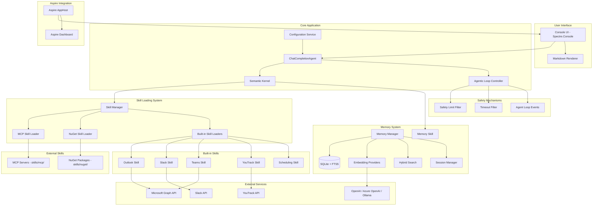
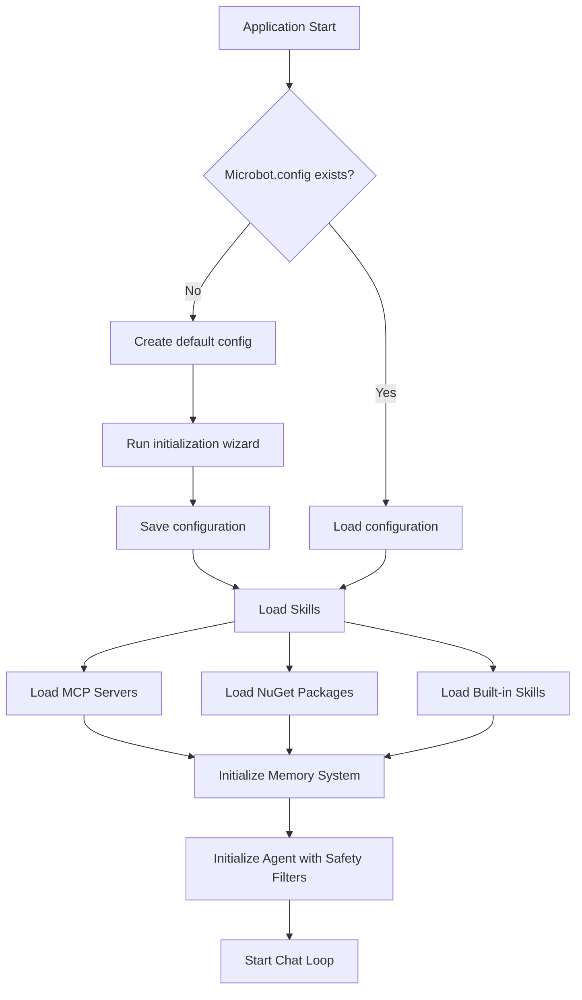
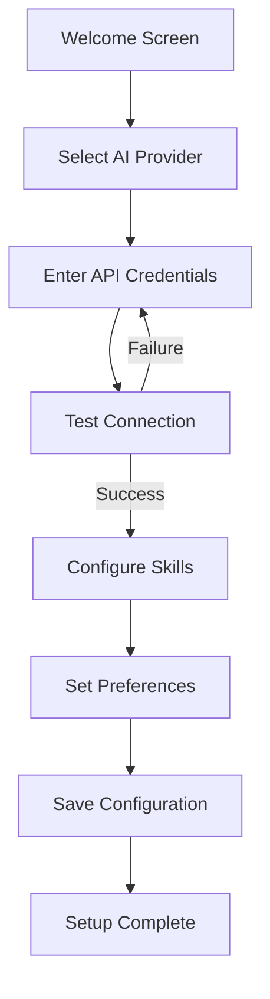
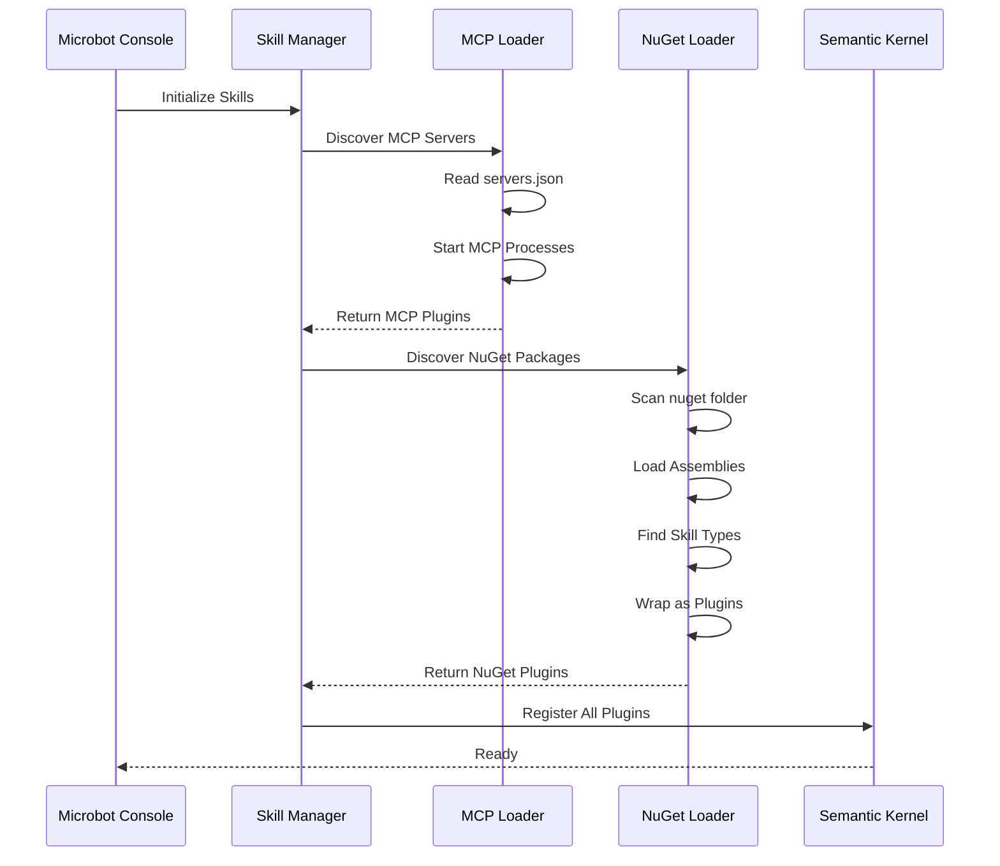

# Microbot Architecture Plan

## Overview

Microbot is an agentic AI application built with Microsoft Semantic Kernel that acts as a personal bot supporting various tools/skills. The application supports two types of AI skills:

1. **MCP Servers** - Model Context Protocol servers loaded from a dedicated MCP folder
2. **NuGet Packages** - .NET assemblies loaded dynamically from a NuGet folder, wrapped as MCP-compatible tools

## Technology Stack

| Component | Technology | Version |
|-----------|------------|---------|
| Runtime | .NET | 10 |
| AI Framework | Microsoft Semantic Kernel | Latest |
| MCP SDK | ModelContextProtocol | Latest (prerelease) |
| Console UI | Spectre.Console | Latest |
| Orchestration | .NET Aspire | Latest |
| Configuration | JSON-based | Custom |

## Solution Structure

```
Microbot/
├── AGENTS.md                          # AI agent development guidelines
├── Microbot.slnx                      # Solution file
├── Microbot.config                    # Main configuration file
├── plans/                             # Architecture and implementation plans
│   ├── microbot-architecture.md       # This file - high-level architecture
│   ├── implementation-plan.md         # Detailed implementation guide
│   ├── agentic-loop-implementation.md # Agentic loop safety mechanisms
│   ├── memory-system-implementation.md # Long-term memory system
│   ├── outlook-skill-implementation.md # Outlook skill details
│   ├── slack-skill-implementation.md  # Slack skill details
│   ├── teams-skill-implementation.md  # Teams skill details
│   ├── youtrack-skill-implementation.md # YouTrack skill details
│   └── scheduling-skill-implementation.md # Scheduling skill details
├── memory/                            # Memory storage folder
│   ├── memory/                        # SQLite database location
│   └── sessions/                      # Session transcripts
├── skills/                            # Runtime skill folders
│   ├── mcp/                           # MCP server configurations
│   └── nuget/                         # NuGet package DLLs
│       └── .gitkeep
└── src/
    ├── Microbot.Console/              # Main console application
    │   ├── Program.cs                 # Entry point and setup wizard
    │   ├── Microbot.Console.csproj
    │   ├── Filters/                   # Semantic Kernel filters
    │   │   ├── SafetyLimitFilter.cs   # Iteration/function call limiting
    │   │   └── TimeoutFilter.cs       # Function timeout enforcement
    │   └── Services/
    │       ├── AgentService.cs        # Main agent orchestration with agentic loop
    │       ├── ConsoleUIService.cs    # Spectre Console UI
    │       ├── MarkdownRenderer.cs    # Markdown to Spectre formatting
    │       ├── McpRegistryService.cs  # MCP registry integration
    │       └── SkillConfigurationService.cs # Skill configuration UI
    │
    ├── Microbot.Core/                 # Core domain logic and models
    │   ├── Microbot.Core.csproj
    │   ├── Interfaces/
    │   │   ├── ISkillLoader.cs
    │   │   └── IConfigurationService.cs
    │   ├── Models/
    │   │   ├── MicrobotConfig.cs      # All configuration models
    │   │   ├── AvailableSkill.cs
    │   │   └── McpRegistry/           # MCP registry models
    │   │       ├── McpEnvironmentVariable.cs
    │   │       ├── McpRegistryPackage.cs
    │   │       ├── McpRegistryResponse.cs
    │   │       └── McpRegistryServer.cs
    │   ├── Configuration/
    │   │   └── ConfigurationService.cs # Configuration management
    │   ├── Events/
    │   │   └── AgentLoopEvents.cs     # Lifecycle events for agent loop
    │   └── Services/
    │       └── McpRegistryClient.cs   # MCP registry API client
    │
    ├── Microbot.Memory/               # Long-term memory system
    │   ├── Microbot.Memory.csproj
    │   ├── MemoryManager.cs           # Main memory orchestration
    │   ├── MemoryManagerFactory.cs    # Factory for creating memory managers
    │   ├── Chunking/
    │   │   ├── ChunkingOptions.cs
    │   │   └── MarkdownChunker.cs     # Markdown-aware text chunking
    │   ├── Database/
    │   │   ├── MemoryDbContext.cs     # EF Core context
    │   │   └── Entities/
    │   │       ├── EmbeddingCache.cs
    │   │       ├── MemoryChunk.cs
    │   │       ├── MemoryFile.cs
    │   │       └── MemoryMeta.cs
    │   ├── Embeddings/
    │   │   ├── EmbeddingProviderFactory.cs
    │   │   ├── OpenAIEmbeddingProvider.cs
    │   │   ├── AzureOpenAIEmbeddingProvider.cs
    │   │   └── OllamaEmbeddingProvider.cs
    │   ├── Interfaces/
    │   │   ├── IEmbeddingProvider.cs
    │   │   ├── IMemoryManager.cs
    │   │   └── ITextChunker.cs
    │   ├── Search/
    │   │   ├── HybridSearch.cs        # Vector + FTS5 search
    │   │   └── VectorSearch.cs
    │   ├── Sessions/
    │   │   ├── SessionManager.cs
    │   │   ├── SessionTranscript.cs
    │   │   └── TranscriptEntry.cs
    │   ├── Skills/
    │   │   └── MemorySkill.cs         # Semantic Kernel plugin
    │   └── Sync/
    │       └── MemorySyncService.cs   # File watching and sync
    │
    ├── Microbot.Skills/               # Skill loading infrastructure
    │   ├── Microbot.Skills.csproj
    │   ├── SkillManager.cs            # Main skill orchestration
    │   └── Loaders/
    │       ├── McpSkillLoader.cs      # MCP server loader
    │       ├── NuGetSkillLoader.cs    # NuGet package loader
    │       ├── OutlookSkillLoader.cs  # Outlook skill loader
    │       ├── SlackSkillLoader.cs    # Slack skill loader
    │       ├── TeamsSkillLoader.cs    # Teams skill loader
    │       ├── YouTrackSkillLoader.cs # YouTrack skill loader
    │       └── SchedulingSkillLoader.cs # Scheduling skill loader
    │
    ├── Microbot.Skills.Outlook/       # Outlook skill (Microsoft Graph)
    │   ├── Microbot.Skills.Outlook.csproj
    │   ├── OutlookSkill.cs            # Semantic Kernel plugin
    │   ├── OutlookSkillMode.cs        # Permission modes
    │   ├── Models/
    │   │   ├── CalendarEvent.cs
    │   │   └── EmailMessage.cs
    │   └── Services/
    │       └── OutlookAuthenticationService.cs
    │
    ├── Microbot.Skills.Slack/         # Slack skill (SlackNet)
    │   ├── Microbot.Skills.Slack.csproj
    │   ├── SlackSkill.cs              # Semantic Kernel plugin
    │   ├── SlackSkillMode.cs          # Permission modes
    │   ├── Models/
    │   │   ├── SlackChannel.cs
    │   │   ├── SlackConversation.cs
    │   │   ├── SlackMessage.cs
    │   │   ├── SlackReadState.cs
    │   │   └── SlackUser.cs
    │   └── Services/
    │       ├── SlackAuthenticationService.cs
    │       └── SlackReadStateTracker.cs
    │
    ├── Microbot.Skills.Teams/         # Teams skill (Microsoft Graph)
    │   ├── Microbot.Skills.Teams.csproj
    │   ├── TeamsSkill.cs              # Semantic Kernel plugin
    │   ├── TeamsSkillMode.cs          # Permission modes
    │   ├── Models/
    │   │   ├── Channel.cs
    │   │   ├── ChannelMessage.cs
    │   │   ├── Chat.cs
    │   │   ├── ChatMessage.cs
    │   │   ├── ReadState.cs
    │   │   └── Team.cs
    │   └── Services/
    │       ├── ReadStateTracker.cs
    │       └── TeamsAuthenticationService.cs
    │
    ├── Microbot.Skills.YouTrack/      # YouTrack skill (JetBrains)
    │   ├── Microbot.Skills.YouTrack.csproj
    │   ├── YouTrackSkill.cs           # Semantic Kernel plugin
    │   ├── YouTrackSkillMode.cs       # Permission modes
    │   ├── Models/
    │   │   ├── YouTrackComment.cs
    │   │   ├── YouTrackIssue.cs
    │   │   ├── YouTrackProject.cs
    │   │   └── YouTrackUser.cs
    │   └── Services/
    │       └── YouTrackApiClient.cs
    │
    ├── Microbot.Skills.Scheduling/    # Scheduling skill (task automation)
    │   ├── Microbot.Skills.Scheduling.csproj
    │   ├── ScheduleSkill.cs           # Semantic Kernel plugin
    │   ├── Database/
    │   │   ├── ScheduleDbContext.cs   # EF Core context
    │   │   └── Entities/
    │   │       ├── Schedule.cs
    │   │       └── ScheduleExecution.cs
    │   ├── Models/
    │   │   ├── ExecutionInfo.cs
    │   │   └── ScheduleInfo.cs
    │   └── Services/
    │       ├── IScheduleService.cs
    │       ├── ScheduleService.cs
    │       ├── ScheduleExecutorService.cs
    │       └── ScheduleExpressionParser.cs
    │
    ├── Microbot.ServiceDefaults/      # Aspire service defaults
    │   ├── Microbot.ServiceDefaults.csproj
    │   └── Extensions.cs
    │
    └── Microbot.AppHost/              # Aspire AppHost
        ├── Microbot.AppHost.csproj
        └── Program.cs
```

## Architecture Diagram



## Component Details

### 1. Microbot.Console

The main entry point console application using Spectre.Console for rich UI.

**Key Features:**
- Beautiful console UI with panels, tables, and progress indicators
- Interactive chat interface with the AI agent
- Markdown rendering for AI responses (headers, code blocks, lists, links)
- Configuration wizard for first-time setup
- Status display showing loaded skills
- Memory commands (/memory status, sync, search, sessions, save)
- Schedule commands (/schedule list, add, remove, enable, disable, history)
- Agentic loop progress display with safety indicators

**Key Services:**
- `AgentService.cs` - Main agent orchestration with agentic loop safety
- `ConsoleUIService.cs` - Spectre Console UI rendering
- `MarkdownRenderer.cs` - Converts markdown to Spectre.Console formatting
- `McpRegistryService.cs` - MCP registry integration for discovering servers
- `SkillConfigurationService.cs` - Interactive skill configuration UI

**Safety Filters:**
- `SafetyLimitFilter.cs` - Limits iterations (10) and function calls (50) per request
- `TimeoutFilter.cs` - Enforces function timeout (30 seconds default)

**Startup Flow:**


### 2. Microbot.Core

Core domain models, interfaces, and events.

**Key Components:**
- `MicrobotConfig.cs` - All configuration models including AgentLoopConfig
- `AgentLoopEvents.cs` - Lifecycle events for monitoring the agentic loop
- `ConfigurationService.cs` - Configuration management with JSON serialization
- `McpRegistryClient.cs` - Client for MCP registry API

**Configuration Model:**
```csharp
public class MicrobotConfig
{
    public string Version { get; set; }
    public AiProviderConfig AiProvider { get; set; }
    public SkillsConfig Skills { get; set; }
    public MemoryConfig Memory { get; set; }
    public AgentLoopConfig AgentLoop { get; set; }
    public UserPreferences Preferences { get; set; }
}

public class AgentLoopConfig
{
    public int MaxIterations { get; set; } = 10;
    public int MaxFunctionCalls { get; set; } = 50;
    public int RuntimeTimeoutSeconds { get; set; } = 600;
    public int FunctionTimeoutSeconds { get; set; } = 30;
}

public class MemoryConfig
{
    public bool Enabled { get; set; } = true;
    public string DatabasePath { get; set; } = "./memory/memory.db";
    public string SessionsPath { get; set; } = "./memory/sessions";
    public string EmbeddingModel { get; set; } = "text-embedding-3-small";
    public int ChunkSize { get; set; } = 512;
    public int ChunkOverlap { get; set; } = 50;
}
```

### 3. Microbot.Memory

Long-term memory system with vector search and session management.

**Key Features:**
- SQLite database with EF Core for persistence
- Markdown-aware text chunking using ML.Tokenizers (cl100k_base)
- Multiple embedding providers (OpenAI, Azure OpenAI, Ollama)
- Hybrid search combining vector similarity and FTS5 full-text search
- Session transcript management for conversation history
- File watching and automatic synchronization
- Memory Semantic Kernel plugin for AI access

**Components:**
- `MemoryManager.cs` - Main orchestration for memory operations
- `MarkdownChunker.cs` - Intelligent text chunking preserving markdown structure
- `HybridSearch.cs` - Combined vector + keyword search
- `SessionManager.cs` - Conversation transcript storage
- `MemorySkill.cs` - Semantic Kernel plugin exposing memory to AI

### 4. Microbot.Skills

The skill loading infrastructure supporting MCP, NuGet, and built-in skills.

**Skill Loaders:**
- `McpSkillLoader.cs` - Loads MCP servers from configuration
- `NuGetSkillLoader.cs` - Loads .NET assemblies dynamically
- `OutlookSkillLoader.cs` - Loads Outlook skill with Microsoft Graph
- `SlackSkillLoader.cs` - Loads Slack skill with SlackNet
- `TeamsSkillLoader.cs` - Loads Teams skill with Microsoft Graph
- `YouTrackSkillLoader.cs` - Loads YouTrack skill
- `SchedulingSkillLoader.cs` - Loads Scheduling skill

#### MCP Skill Loading

MCP servers are loaded using the official MCP C# SDK:

```csharp
// Example MCP server configuration in skills/mcp/servers.json
{
    "servers": [
        {
            "name": "github",
            "command": "npx",
            "args": ["-y", "@modelcontextprotocol/server-github"],
            "env": {
                "GITHUB_TOKEN": "${GITHUB_TOKEN}"
            }
        }
    ]
}
```

### 5. Built-in Skills

#### Outlook Skill (Microbot.Skills.Outlook)
Microsoft Graph integration for email and calendar management.
- **Permission Modes:** ReadOnly, ReadWriteCalendar, Full
- **Features:** Email (list, get, search, send, reply, forward), Calendar (list, get, create, update, delete)
- **Authentication:** Device Code and Interactive Browser flows

#### Slack Skill (Microbot.Skills.Slack)
SlackNet integration for Slack workspace communication.
- **Permission Modes:** ReadOnly, Full
- **Features:** Channel messages, Direct messages, Unread tracking
- **Authentication:** Bot Token (xoxb-)

#### Teams Skill (Microbot.Skills.Teams)
Microsoft Graph integration for Teams communication.
- **Permission Modes:** ReadOnly, Full
- **Features:** Channel messages, Chat messages, Multi-tenant support
- **Status:** Planned

#### YouTrack Skill (Microbot.Skills.YouTrack)
JetBrains YouTrack integration for issue tracking.
- **Permission Modes:** ReadOnly, FullControl
- **Features:** Issues (list, get, search, create, update), Comments, Projects, Commands
- **Authentication:** Permanent token

#### Scheduling Skill (Microbot.Skills.Scheduling)
Task automation with cron-based scheduling.
- **Features:** Recurring schedules (cron), One-time schedules, Natural language parsing
- **Storage:** SQLite with EF Core
- **Execution:** Background service with configurable check interval

### 6. Aspire Integration

The Aspire AppHost orchestrates the application and provides monitoring capabilities.

```csharp
// Microbot.AppHost/Program.cs
var builder = DistributedApplication.CreateBuilder(args);

var microbot = builder.AddProject<Projects.Microbot_Console>("microbot")
    .WithEnvironment("ASPIRE_ENABLED", "true");

builder.Build().Run();
```

## Configuration System

### Microbot.config Structure

```json
{
    "version": "1.0",
    "aiProvider": {
        "provider": "AzureOpenAI",
        "modelId": "gpt-4o",
        "endpoint": "",
        "apiKey": ""
    },
    "skills": {
        "mcpFolder": "./skills/mcp",
        "nugetFolder": "./skills/nuget",
        "mcpServers": [],
        "nugetSkills": []
    },
    "preferences": {
        "theme": "default",
        "verboseLogging": false
    }
}
```

### First-Time Setup Wizard

When `Microbot.config` does not exist, the application runs an initialization wizard:



## Skill Discovery Flow



## Key NuGet Packages

| Package | Purpose |
|---------|---------|
| Microsoft.SemanticKernel | AI agent framework |
| Microsoft.SemanticKernel.Agents.Core | Agent abstractions |
| ModelContextProtocol | MCP C# SDK |
| Spectre.Console | Console UI |
| Aspire.Hosting | Aspire orchestration |
| System.Text.Json | Configuration serialization |
| Microsoft.EntityFrameworkCore.Sqlite | Database for memory and scheduling |
| Microsoft.Graph | Microsoft Graph API for Outlook/Teams |
| SlackNet | Slack API integration |
| ML.Tokenizers | Text tokenization for chunking |
| Cronos | Cron expression parsing |

## Implementation Phases

### Phase 1: Foundation ✅ COMPLETED
- [x] Create solution structure
- [x] Set up Microbot.Console with Spectre.Console
- [x] Implement basic configuration system
- [x] Create Microbot.config file handling

### Phase 2: Semantic Kernel Integration ✅ COMPLETED
- [x] Set up Semantic Kernel with ChatCompletionAgent
- [x] Implement basic chat loop
- [x] Add AI provider configuration (OpenAI, Azure OpenAI, Ollama)

### Phase 3: Skill Loading System ✅ COMPLETED
- [x] Implement MCP skill loader
- [x] Implement NuGet skill loader
- [x] Create NuGet to MCP wrapper
- [x] Add skill discovery and registration

### Phase 4: Aspire Integration ✅ COMPLETED
- [x] Add Aspire AppHost project
- [x] Configure service defaults
- [x] Set up telemetry and monitoring

### Phase 5: Configuration Wizard ✅ COMPLETED
- [x] Implement first-time setup wizard
- [x] Add configuration validation
- [x] Create interactive prompts

### Phase 6: AI Provider Support ✅ COMPLETED
- [x] OpenAI provider support
- [x] Azure OpenAI provider support
- [x] Ollama provider support (via OpenAI-compatible API)

### Phase 7: Agentic Loop Safety ✅ COMPLETED
- [x] Implement iteration limiting (max 10 per request)
- [x] Implement function call limiting (max 50 per request)
- [x] Add runtime timeout (600 seconds default)
- [x] Add function timeout (30 seconds per function)
- [x] Create lifecycle events for monitoring
- [x] Add progress display in console
- [x] Add system prompt safety guidelines

### Phase 8: Markdown Rendering ✅ COMPLETED
- [x] Headers (H1-H6) with color-coded styling
- [x] Bold, italic, strikethrough text formatting
- [x] Code blocks with language indication panels
- [x] Inline code with background highlighting
- [x] Ordered and unordered lists with proper indentation
- [x] Links with clickable formatting
- [x] Blockquotes and horizontal rules

### Phase 9: Outlook Skill ✅ COMPLETED
- [x] Microsoft Graph integration
- [x] Email operations (list, get, search, send, reply, forward)
- [x] Calendar operations (list, get, create, update, delete)
- [x] Permission modes (ReadOnly, ReadWriteCalendar, Full)
- [x] Device Code and Interactive Browser authentication

### Phase 10: Slack Skill ✅ COMPLETED
- [x] SlackNet integration
- [x] Channel messages (list, read, send)
- [x] Direct messages (list, read, send)
- [x] Unread message tracking
- [x] Permission modes (ReadOnly, Full)
- [x] Bot Token authentication

### Phase 11: Long-term Memory System ✅ COMPLETED
- [x] SQLite database with EF Core
- [x] Markdown-aware text chunking (ML.Tokenizers)
- [x] Multiple embedding providers (OpenAI, Azure OpenAI, Ollama)
- [x] Hybrid search (vector similarity + FTS5)
- [x] Session transcript management
- [x] File watching and automatic sync
- [x] Memory Semantic Kernel plugin
- [x] Console commands (/memory)

### Phase 12: YouTrack Skill ✅ COMPLETED
- [x] YouTrack API integration
- [x] Issue management (list, get, search, create, update)
- [x] Comment management (list, add, update)
- [x] Project listing and details
- [x] Command execution
- [x] Permission modes (ReadOnly, FullControl)
- [x] Permanent token authentication

### Phase 13: Scheduling Skill ✅ COMPLETED
- [x] Recurring schedules (cron expressions)
- [x] One-time schedules
- [x] Natural language parsing
- [x] SQLite database storage
- [x] Execution history tracking
- [x] Console commands (/schedule)
- [x] Background executor service

### Phase 14: Teams Skill 🔲 PLANNED
- [ ] Microsoft Graph integration
- [ ] Multi-tenant support (home + guest tenants)
- [ ] Channel messages (read, send, reply)
- [ ] Chat messages (read, send)
- [ ] Unread message tracking
- [ ] Permission modes (ReadOnly, Full)

## Security Considerations

1. **API Key Storage**: API keys should be stored securely, consider using environment variables or secure storage
2. **Assembly Loading**: Only load assemblies from trusted sources in the nuget folder
3. **MCP Server Isolation**: MCP servers run as separate processes with limited permissions
4. **Configuration Encryption**: Consider encrypting sensitive configuration values
5. **Agentic Loop Safety**: Iteration and function call limits prevent runaway AI loops
6. **Function Timeouts**: Individual function timeouts prevent hanging operations
7. **Permission Modes**: Skills support read-only modes to limit AI capabilities

## Future Enhancements

1. **Custom UI via Aspire**: Web-based dashboard for monitoring and configuration
2. **Plugin Marketplace**: Download and install skills from a central repository
3. **Multi-Agent Support**: Support for multiple specialized agents
4. **Skill Hot-Reload**: Reload skills without restarting the application
5. **Teams Skill Completion**: Finish Microsoft Teams integration
6. **Voice Interface**: Speech-to-text and text-to-speech support
7. **Proactive Notifications**: Agent-initiated notifications based on schedules or events
8. **Skill Chaining**: Allow skills to invoke other skills for complex workflows
