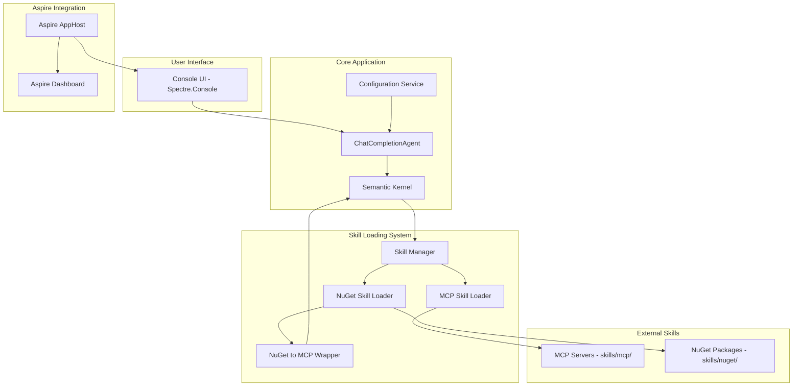
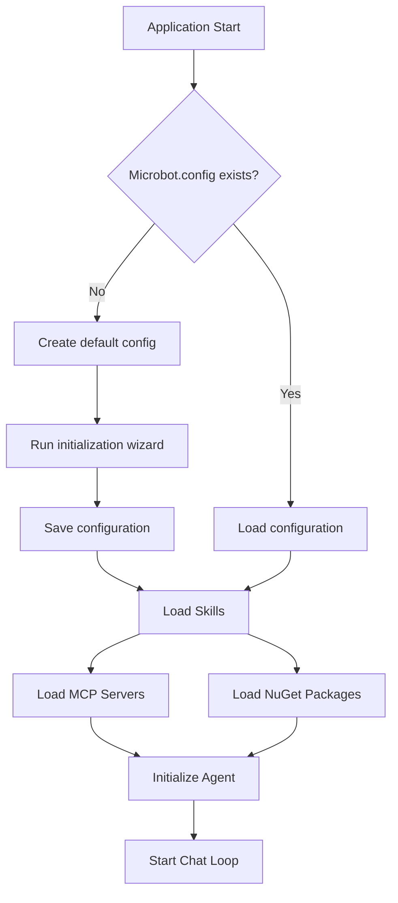
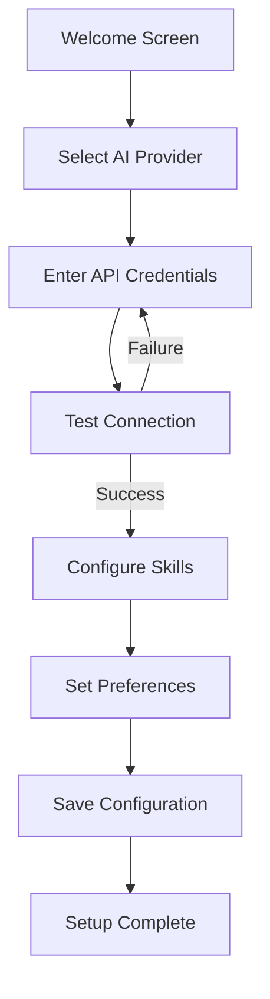
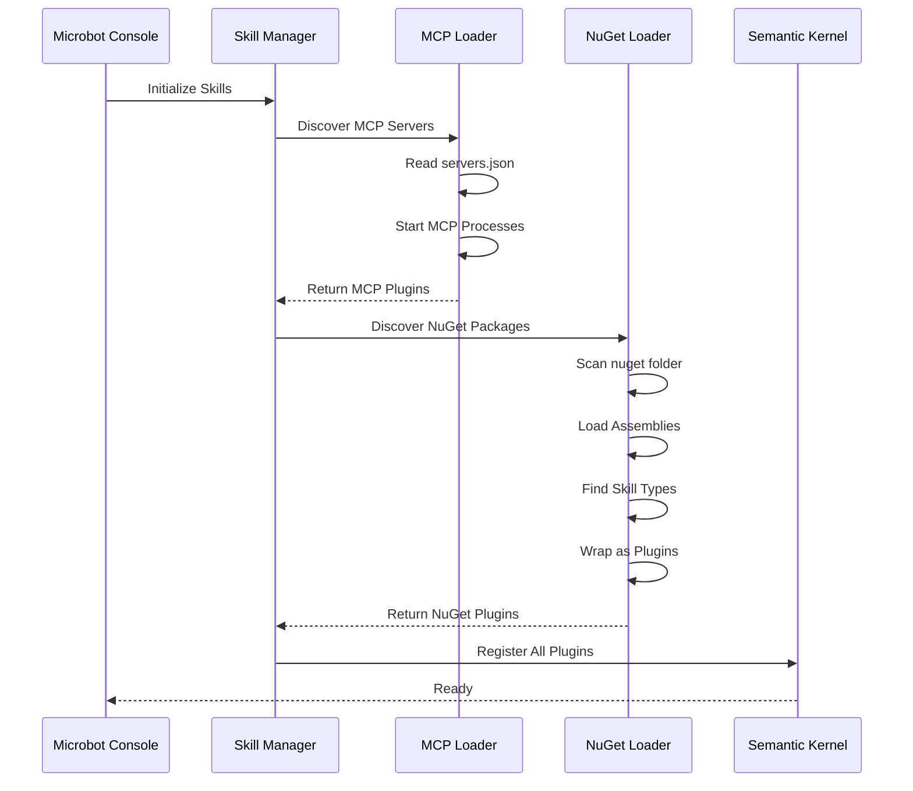

# Microbot Architecture Plan

## Overview

Microbot is an agentic AI application built with Microsoft Semantic Kernel that acts as a personal bot supporting various tools/skills. The application supports two types of AI skills:

1. **MCP Servers** - Model Context Protocol servers loaded from a dedicated MCP folder
2. **NuGet Packages** - .NET assemblies loaded dynamically from a NuGet folder, wrapped as MCP-compatible tools

## Technology Stack

| Component | Technology | Version |
|-----------|------------|---------|
| Runtime | .NET | 10 |
| AI Framework | Microsoft Semantic Kernel | Latest |
| MCP SDK | ModelContextProtocol | Latest (prerelease) |
| Console UI | Spectre.Console | Latest |
| Orchestration | .NET Aspire | Latest |
| Configuration | JSON-based | Custom |

## Solution Structure

```
Microbot/
├── Microbot.sln
├── src/
│   ├── Microbot.Console/              # Main console application
│   │   ├── Program.cs
│   │   ├── Microbot.Console.csproj
│   │   ├── Services/
│   │   │   ├── AgentService.cs        # Main agent orchestration
│   │   │   ├── ConfigurationService.cs # Configuration management
│   │   │   └── ConsoleUIService.cs    # Spectre Console UI
│   │   └── appsettings.json
│   │
│   ├── Microbot.Core/                 # Core domain logic
│   │   ├── Microbot.Core.csproj
│   │   ├── Interfaces/
│   │   │   ├── ISkillLoader.cs
│   │   │   ├── IMcpSkillProvider.cs
│   │   │   └── INuGetSkillProvider.cs
│   │   ├── Models/
│   │   │   ├── MicrobotConfig.cs
│   │   │   ├── SkillDefinition.cs
│   │   │   └── AgentContext.cs
│   │   └── Configuration/
│   │       └── ConfigurationManager.cs
│   │
│   ├── Microbot.Skills/               # Skill loading infrastructure
│   │   ├── Microbot.Skills.csproj
│   │   ├── Loaders/
│   │   │   ├── McpSkillLoader.cs      # MCP server loader
│   │   │   └── NuGetSkillLoader.cs    # NuGet package loader
│   │   ├── Wrappers/
│   │   │   └── NuGetToMcpWrapper.cs   # Wraps NuGet classes as MCP tools
│   │   └── Discovery/
│   │       ├── McpServerDiscovery.cs
│   │       └── NuGetPackageDiscovery.cs
│   │
│   ├── Microbot.ServiceDefaults/      # Aspire service defaults
│   │   └── Microbot.ServiceDefaults.csproj
│   │
│   └── Microbot.AppHost/              # Aspire AppHost
│       ├── Microbot.AppHost.csproj
│       └── Program.cs
│
├── skills/                            # Runtime skill folders
│   ├── mcp/                           # MCP server configurations
│   │   └── servers.json               # MCP server definitions
│   └── nuget/                         # NuGet package DLLs
│       └── .gitkeep
│
└── Microbot.config                    # Main configuration file
```

## Architecture Diagram



## Component Details

### 1. Microbot.Console

The main entry point console application using Spectre.Console for rich UI.

**Key Features:**
- Beautiful console UI with panels, tables, and progress indicators
- Interactive chat interface with the AI agent
- Configuration wizard for first-time setup
- Status display showing loaded skills

**Startup Flow:**


### 2. Microbot.Core

Core domain models and interfaces.

**Configuration Model:**
```csharp
public class MicrobotConfig
{
    public string Version { get; set; }
    public AiProviderConfig AiProvider { get; set; }
    public SkillsConfig Skills { get; set; }
    public UserPreferences Preferences { get; set; }
}

public class AiProviderConfig
{
    public string Provider { get; set; }  // OpenAI, AzureOpenAI, Ollama
    public string ModelId { get; set; }
    public string Endpoint { get; set; }  // Required for Azure/Ollama
    public string ApiKey { get; set; }    // Not required for Ollama
}

public class SkillsConfig
{
    public string McpFolder { get; set; }
    public string NuGetFolder { get; set; }
    public List<McpServerConfig> McpServers { get; set; }
    public List<NuGetSkillConfig> NuGetSkills { get; set; }
}
```

### 3. Microbot.Skills

The skill loading infrastructure supporting both MCP and NuGet-based skills.

#### MCP Skill Loading

MCP servers are loaded using the official MCP C# SDK:

```csharp
// Example MCP server configuration in skills/mcp/servers.json
{
    "servers": [
        {
            "name": "outlook",
            "description": "Outlook email integration",
            "command": "dotnet",
            "args": ["run", "--project", "path/to/outlook-mcp-server"],
            "env": {}
        },
        {
            "name": "github",
            "command": "npx",
            "args": ["-y", "@modelcontextprotocol/server-github"],
            "env": {
                "GITHUB_TOKEN": "${GITHUB_TOKEN}"
            }
        }
    ]
}
```

#### NuGet Skill Loading

NuGet packages are loaded dynamically using `AssemblyLoadContext`:

```csharp
public class NuGetSkillLoader
{
    private readonly AssemblyLoadContext _loadContext;
    
    public async Task<IEnumerable<KernelPlugin>> LoadSkillsAsync(string nugetFolder)
    {
        var plugins = new List<KernelPlugin>();
        
        foreach (var dllPath in Directory.GetFiles(nugetFolder, "*.dll"))
        {
            var assembly = _loadContext.LoadFromAssemblyPath(dllPath);
            
            // Find types with [MicrobotSkill] attribute
            var skillTypes = assembly.GetTypes()
                .Where(t => t.GetCustomAttribute<MicrobotSkillAttribute>() != null);
            
            foreach (var skillType in skillTypes)
            {
                var instance = Activator.CreateInstance(skillType);
                var plugin = KernelPluginFactory.CreateFromObject(instance);
                plugins.Add(plugin);
            }
        }
        
        return plugins;
    }
}
```

#### NuGet to MCP Wrapper

The wrapper exposes NuGet-loaded classes as MCP-compatible tools:

```csharp
public class NuGetToMcpWrapper
{
    public KernelPlugin WrapAsPlugin(object instance, string pluginName)
    {
        var methods = instance.GetType()
            .GetMethods(BindingFlags.Public | BindingFlags.Instance)
            .Where(m => m.GetCustomAttribute<KernelFunctionAttribute>() != null);
        
        var functions = methods.Select(m => 
            KernelFunctionFactory.CreateFromMethod(m, instance));
        
        return KernelPluginFactory.CreateFromFunctions(pluginName, functions);
    }
}
```

### 4. Aspire Integration

The Aspire AppHost orchestrates the application and provides monitoring capabilities.

```csharp
// Microbot.AppHost/Program.cs
var builder = DistributedApplication.CreateBuilder(args);

var microbot = builder.AddProject<Projects.Microbot_Console>("microbot")
    .WithEnvironment("ASPIRE_ENABLED", "true");

builder.Build().Run();
```

## Configuration System

### Microbot.config Structure

```json
{
    "version": "1.0",
    "aiProvider": {
        "provider": "AzureOpenAI",
        "modelId": "gpt-4o",
        "endpoint": "",
        "apiKey": ""
    },
    "skills": {
        "mcpFolder": "./skills/mcp",
        "nugetFolder": "./skills/nuget",
        "mcpServers": [],
        "nugetSkills": []
    },
    "preferences": {
        "theme": "default",
        "verboseLogging": false
    }
}
```

### First-Time Setup Wizard

When `Microbot.config` does not exist, the application runs an initialization wizard:



## Skill Discovery Flow



## Key NuGet Packages

| Package | Purpose |
|---------|---------|
| Microsoft.SemanticKernel | AI agent framework |
| Microsoft.SemanticKernel.Agents.Core | Agent abstractions |
| ModelContextProtocol | MCP C# SDK |
| Spectre.Console | Console UI |
| Aspire.Hosting | Aspire orchestration |
| System.Text.Json | Configuration serialization |

## Implementation Phases

### Phase 1: Foundation ✅ COMPLETED
- [x] Create solution structure
- [x] Set up Microbot.Console with Spectre.Console
- [x] Implement basic configuration system
- [x] Create Microbot.config file handling

### Phase 2: Semantic Kernel Integration ✅ COMPLETED
- [x] Set up Semantic Kernel with ChatCompletionAgent
- [x] Implement basic chat loop
- [x] Add AI provider configuration (OpenAI, Azure OpenAI, Ollama)

### Phase 3: Skill Loading System ✅ COMPLETED
- [x] Implement MCP skill loader
- [x] Implement NuGet skill loader
- [x] Create NuGet to MCP wrapper
- [x] Add skill discovery and registration

### Phase 4: Aspire Integration ✅ COMPLETED
- [x] Add Aspire AppHost project
- [x] Configure service defaults
- [x] Set up telemetry and monitoring

### Phase 5: Configuration Wizard ✅ COMPLETED
- [x] Implement first-time setup wizard
- [x] Add configuration validation
- [x] Create interactive prompts

### Phase 6: AI Provider Support ✅ COMPLETED
- [x] OpenAI provider support
- [x] Azure OpenAI provider support
- [x] Ollama provider support (via OpenAI-compatible API)

## Security Considerations

1. **API Key Storage**: API keys should be stored securely, consider using environment variables or secure storage
2. **Assembly Loading**: Only load assemblies from trusted sources in the nuget folder
3. **MCP Server Isolation**: MCP servers run as separate processes with limited permissions
4. **Configuration Encryption**: Consider encrypting sensitive configuration values

## Future Enhancements

1. **Custom UI via Aspire**: Web-based dashboard for monitoring and configuration
2. **Plugin Marketplace**: Download and install skills from a central repository
3. **Multi-Agent Support**: Support for multiple specialized agents
4. **Conversation History**: Persistent conversation storage
5. **Skill Hot-Reload**: Reload skills without restarting the application
