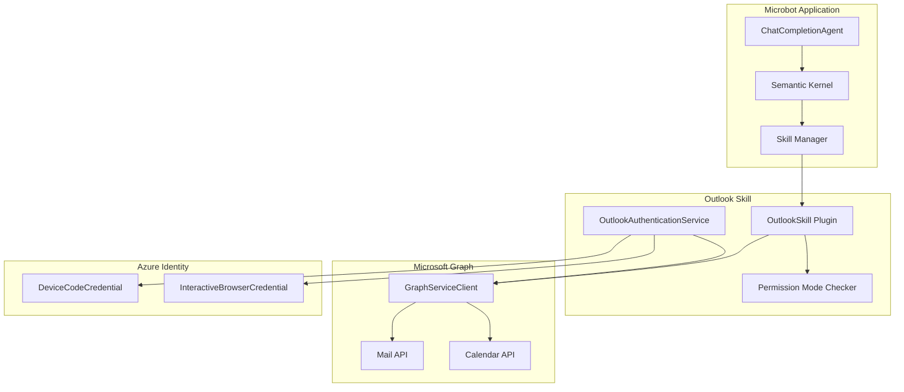

# Outlook Skill Implementation Plan

This document provides a detailed implementation plan for the Outlook skill in Microbot.

## Overview

The Outlook skill enables Microbot to interact with Microsoft Outlook via the Microsoft Graph API. It supports three permission modes:

| Mode | Capabilities |
|------|-------------|
| **ReadOnly** | Read emails, read calendar events |
| **ReadWriteCalendar** | ReadOnly + create/update/delete calendar events |
| **Full** | ReadWriteCalendar + send emails, reply, forward |

## Architecture



## Prerequisites

### Azure AD App Registration

Before using the Outlook skill, you need to register an application in Azure AD/Entra ID:

1. Go to [Azure Portal](https://portal.azure.com) > Azure Active Directory > App registrations
2. Click **New registration**
3. Configure the application:
   - **Name**: `Microbot Outlook Skill`
   - **Supported account types**: Choose based on your needs:
     - Single tenant: Only your organization
     - Multi-tenant: Any Azure AD directory
     - Personal accounts: Include Microsoft accounts
   - **Redirect URI**: 
     - For Interactive Browser: `http://localhost` (Web)
     - For Device Code: Leave empty
4. After creation, note the **Application (client) ID**
5. Go to **Authentication** > **Advanced settings**:
   - Enable **Allow public client flows** (required for Device Code)
6. Go to **API permissions** > **Add a permission** > **Microsoft Graph**:
   - Add **Delegated permissions** based on mode:

| Permission | ReadOnly | ReadWriteCalendar | Full |
|------------|----------|-------------------|------|
| `Mail.Read` | ✅ | ✅ | ✅ |
| `Calendars.Read` | ✅ | ✅ | ✅ |
| `Calendars.ReadWrite` | ❌ | ✅ | ✅ |
| `Mail.Send` | ❌ | ❌ | ✅ |
| `User.Read` | ✅ | ✅ | ✅ |

7. Click **Grant admin consent** if required by your organization

## Project Structure

```
src/
├── Microbot.Skills.Outlook/           # New project
│   ├── Microbot.Skills.Outlook.csproj
│   ├── OutlookSkill.cs                # Main skill with KernelFunctions
│   ├── OutlookSkillMode.cs            # Permission mode enum
│   ├── Services/
│   │   └── OutlookAuthenticationService.cs
│   └── Models/
│       ├── EmailMessage.cs
│       └── CalendarEvent.cs
├── Microbot.Core/
│   └── Models/
│       └── MicrobotConfig.cs          # Updated with OutlookSkillConfig
└── Microbot.Skills/
    └── SkillManager.cs                # Updated to load Outlook skill
```

## Implementation Details

### Phase 1: Project Setup and Configuration

#### Step 1.1: Create Microbot.Skills.Outlook Project

```bash
cd src
dotnet new classlib -n Microbot.Skills.Outlook -o Microbot.Skills.Outlook
cd ..
dotnet sln add src/Microbot.Skills.Outlook/Microbot.Skills.Outlook.csproj
```

#### Step 1.2: Add NuGet Packages

**Microbot.Skills.Outlook.csproj:**
```xml
<Project Sdk="Microsoft.NET.Sdk">

  <PropertyGroup>
    <TargetFramework>net10.0</TargetFramework>
    <ImplicitUsings>enable</ImplicitUsings>
    <Nullable>enable</Nullable>
  </PropertyGroup>

  <ItemGroup>
    <ProjectReference Include="..\Microbot.Core\Microbot.Core.csproj" />
  </ItemGroup>

  <ItemGroup>
    <PackageReference Include="Azure.Identity" Version="1.13.2" />
    <PackageReference Include="Microsoft.Graph" Version="5.78.0" />
    <PackageReference Include="Microsoft.SemanticKernel" Version="1.70.0" />
    <PackageReference Include="Microsoft.Extensions.Logging.Abstractions" Version="10.0.2" />
  </ItemGroup>

</Project>
```

#### Step 1.3: Define OutlookSkillMode Enum

**OutlookSkillMode.cs:**
```csharp
namespace Microbot.Skills.Outlook;

/// <summary>
/// Defines the permission mode for the Outlook skill.
/// </summary>
public enum OutlookSkillMode
{
    /// <summary>
    /// Read-only access to emails and calendar.
    /// Permissions: Mail.Read, Calendars.Read, User.Read
    /// </summary>
    ReadOnly,

    /// <summary>
    /// Read emails and calendar, write calendar events.
    /// Permissions: Mail.Read, Calendars.Read, Calendars.ReadWrite, User.Read
    /// </summary>
    ReadWriteCalendar,

    /// <summary>
    /// Full access: read/send emails, read/write calendar.
    /// Permissions: Mail.Read, Mail.Send, Calendars.Read, Calendars.ReadWrite, User.Read
    /// </summary>
    Full
}
```

#### Step 1.4: Update MicrobotConfig

Add to **MicrobotConfig.cs:**
```csharp
/// <summary>
/// Configuration for the Outlook skill.
/// </summary>
public class OutlookSkillConfig
{
    /// <summary>
    /// Whether the Outlook skill is enabled.
    /// </summary>
    public bool Enabled { get; set; } = false;

    /// <summary>
    /// The permission mode for the Outlook skill.
    /// </summary>
    public string Mode { get; set; } = "ReadOnly";

    /// <summary>
    /// Azure AD Application (client) ID.
    /// </summary>
    public string? ClientId { get; set; }

    /// <summary>
    /// Azure AD Tenant ID. Use "common" for multi-tenant or personal accounts.
    /// </summary>
    public string TenantId { get; set; } = "common";

    /// <summary>
    /// Authentication method: "DeviceCode" or "InteractiveBrowser".
    /// </summary>
    public string AuthenticationMethod { get; set; } = "DeviceCode";

    /// <summary>
    /// Redirect URI for Interactive Browser authentication.
    /// </summary>
    public string RedirectUri { get; set; } = "http://localhost";
}
```

Update **SkillsConfig** class:
```csharp
public class SkillsConfig
{
    // ... existing properties ...

    /// <summary>
    /// Outlook skill configuration.
    /// </summary>
    public OutlookSkillConfig Outlook { get; set; } = new();
}
```

### Phase 2: Authentication Service

#### Step 2.1: Implement OutlookAuthenticationService

**Services/OutlookAuthenticationService.cs:**
```csharp
namespace Microbot.Skills.Outlook.Services;

using Azure.Identity;
using Microsoft.Extensions.Logging;
using Microsoft.Graph;
using Microbot.Core.Models;

/// <summary>
/// Handles authentication for the Outlook skill using Azure Identity.
/// </summary>
public class OutlookAuthenticationService
{
    private readonly OutlookSkillConfig _config;
    private readonly ILogger<OutlookAuthenticationService>? _logger;
    private GraphServiceClient? _graphClient;

    public OutlookAuthenticationService(
        OutlookSkillConfig config,
        ILogger<OutlookAuthenticationService>? logger = null)
    {
        _config = config;
        _logger = logger;
    }

    /// <summary>
    /// Gets the scopes required for the configured mode.
    /// </summary>
    public string[] GetRequiredScopes()
    {
        var mode = Enum.Parse<OutlookSkillMode>(_config.Mode, ignoreCase: true);
        
        return mode switch
        {
            OutlookSkillMode.ReadOnly => new[]
            {
                "User.Read",
                "Mail.Read",
                "Calendars.Read"
            },
            OutlookSkillMode.ReadWriteCalendar => new[]
            {
                "User.Read",
                "Mail.Read",
                "Calendars.Read",
                "Calendars.ReadWrite"
            },
            OutlookSkillMode.Full => new[]
            {
                "User.Read",
                "Mail.Read",
                "Mail.Send",
                "Calendars.Read",
                "Calendars.ReadWrite"
            },
            _ => throw new ArgumentException($"Unknown mode: {_config.Mode}")
        };
    }

    /// <summary>
    /// Creates and returns an authenticated GraphServiceClient.
    /// </summary>
    public async Task<GraphServiceClient> GetGraphClientAsync(
        Action<string>? deviceCodeCallback = null,
        CancellationToken cancellationToken = default)
    {
        if (_graphClient != null)
            return _graphClient;

        if (string.IsNullOrEmpty(_config.ClientId))
            throw new InvalidOperationException("ClientId is required for Outlook skill");

        var scopes = GetRequiredScopes();
        
        _logger?.LogInformation(
            "Authenticating with method: {Method}, Scopes: {Scopes}",
            _config.AuthenticationMethod,
            string.Join(", ", scopes));

        TokenCredential credential = _config.AuthenticationMethod.ToLowerInvariant() switch
        {
            "devicecode" => CreateDeviceCodeCredential(deviceCodeCallback),
            "interactivebrowser" => CreateInteractiveBrowserCredential(),
            _ => throw new ArgumentException(
                $"Unknown authentication method: {_config.AuthenticationMethod}")
        };

        _graphClient = new GraphServiceClient(credential, scopes);
        
        // Verify authentication by getting user info
        var user = await _graphClient.Me.GetAsync(cancellationToken: cancellationToken);
        _logger?.LogInformation("Authenticated as: {User}", user?.DisplayName ?? user?.UserPrincipalName);

        return _graphClient;
    }

    private DeviceCodeCredential CreateDeviceCodeCredential(Action<string>? callback)
    {
        var options = new DeviceCodeCredentialOptions
        {
            ClientId = _config.ClientId,
            TenantId = _config.TenantId,
            DeviceCodeCallback = (info, ct) =>
            {
                var message = info.Message;
                _logger?.LogInformation("Device Code: {Message}", message);
                callback?.Invoke(message);
                return Task.CompletedTask;
            }
        };

        return new DeviceCodeCredential(options);
    }

    private InteractiveBrowserCredential CreateInteractiveBrowserCredential()
    {
        var options = new InteractiveBrowserCredentialOptions
        {
            ClientId = _config.ClientId,
            TenantId = _config.TenantId,
            RedirectUri = new Uri(_config.RedirectUri)
        };

        return new InteractiveBrowserCredential(options);
    }
}
```

### Phase 3: Outlook Skill Implementation

#### Step 3.1: Create Model Classes

**Models/EmailMessage.cs:**
```csharp
namespace Microbot.Skills.Outlook.Models;

/// <summary>
/// Simplified email message model for AI consumption.
/// </summary>
public class EmailMessage
{
    public string Id { get; set; } = string.Empty;
    public string Subject { get; set; } = string.Empty;
    public string From { get; set; } = string.Empty;
    public List<string> To { get; set; } = [];
    public string BodyPreview { get; set; } = string.Empty;
    public string Body { get; set; } = string.Empty;
    public DateTime ReceivedDateTime { get; set; }
    public bool IsRead { get; set; }
    public bool HasAttachments { get; set; }
}
```

**Models/CalendarEvent.cs:**
```csharp
namespace Microbot.Skills.Outlook.Models;

/// <summary>
/// Simplified calendar event model for AI consumption.
/// </summary>
public class CalendarEvent
{
    public string Id { get; set; } = string.Empty;
    public string Subject { get; set; } = string.Empty;
    public string Body { get; set; } = string.Empty;
    public DateTime Start { get; set; }
    public DateTime End { get; set; }
    public string Location { get; set; } = string.Empty;
    public List<string> Attendees { get; set; } = [];
    public bool IsOnlineMeeting { get; set; }
    public string? OnlineMeetingUrl { get; set; }
}
```

#### Step 3.2: Implement OutlookSkill

**OutlookSkill.cs:**
```csharp
namespace Microbot.Skills.Outlook;

using System.ComponentModel;
using System.Text.Json;
using Microsoft.Extensions.Logging;
using Microsoft.Graph;
using Microsoft.Graph.Models;
using Microsoft.SemanticKernel;
using Microbot.Core.Models;
using Microbot.Skills.Outlook.Models;
using Microbot.Skills.Outlook.Services;

/// <summary>
/// Outlook skill providing email and calendar functionality via Microsoft Graph.
/// </summary>
public class OutlookSkill
{
    private readonly OutlookSkillConfig _config;
    private readonly OutlookSkillMode _mode;
    private readonly OutlookAuthenticationService _authService;
    private readonly ILogger<OutlookSkill>? _logger;
    private GraphServiceClient? _graphClient;
    private Action<string>? _deviceCodeCallback;

    public OutlookSkill(
        OutlookSkillConfig config,
        ILogger<OutlookSkill>? logger = null,
        Action<string>? deviceCodeCallback = null)
    {
        _config = config;
        _mode = Enum.Parse<OutlookSkillMode>(config.Mode, ignoreCase: true);
        _authService = new OutlookAuthenticationService(config, 
            logger as ILogger<OutlookAuthenticationService>);
        _logger = logger;
        _deviceCodeCallback = deviceCodeCallback;
    }

    private async Task<GraphServiceClient> GetClientAsync(CancellationToken ct = default)
    {
        _graphClient ??= await _authService.GetGraphClientAsync(_deviceCodeCallback, ct);
        return _graphClient;
    }

    private void EnsurePermission(OutlookSkillMode requiredMode, string operation)
    {
        if (_mode < requiredMode)
        {
            throw new InvalidOperationException(
                $"Operation '{operation}' requires {requiredMode} mode, " +
                $"but current mode is {_mode}");
        }
    }

    #region Email Reading Functions (ReadOnly)

    [KernelFunction("list_emails")]
    [Description("Lists recent emails from the inbox. Returns subject, sender, date, and preview.")]
    public async Task<string> ListEmailsAsync(
        [Description("Maximum number of emails to return (default: 10, max: 50)")]
        int count = 10,
        [Description("Filter by unread only")]
        bool unreadOnly = false,
        CancellationToken cancellationToken = default)
    {
        var client = await GetClientAsync(cancellationToken);
        
        count = Math.Min(Math.Max(count, 1), 50);
        
        var request = client.Me.Messages;
        var query = request.GetAsync(config =>
        {
            config.QueryParameters.Top = count;
            config.QueryParameters.Select = new[] 
            { 
                "id", "subject", "from", "toRecipients", 
                "receivedDateTime", "bodyPreview", "isRead", "hasAttachments" 
            };
            config.QueryParameters.Orderby = new[] { "receivedDateTime desc" };
            
            if (unreadOnly)
            {
                config.QueryParameters.Filter = "isRead eq false";
            }
        }, cancellationToken);

        var messages = await query;
        
        var result = messages?.Value?.Select(m => new EmailMessage
        {
            Id = m.Id ?? string.Empty,
            Subject = m.Subject ?? "(No Subject)",
            From = m.From?.EmailAddress?.Address ?? "Unknown",
            To = m.ToRecipients?.Select(r => r.EmailAddress?.Address ?? "").ToList() ?? [],
            BodyPreview = m.BodyPreview ?? string.Empty,
            ReceivedDateTime = m.ReceivedDateTime?.DateTime ?? DateTime.MinValue,
            IsRead = m.IsRead ?? false,
            HasAttachments = m.HasAttachments ?? false
        }).ToList() ?? [];

        return JsonSerializer.Serialize(result, new JsonSerializerOptions { WriteIndented = true });
    }

    [KernelFunction("get_email")]
    [Description("Gets the full content of a specific email by its ID.")]
    public async Task<string> GetEmailAsync(
        [Description("The ID of the email to retrieve")]
        string emailId,
        CancellationToken cancellationToken = default)
    {
        var client = await GetClientAsync(cancellationToken);
        
        var message = await client.Me.Messages[emailId].GetAsync(config =>
        {
            config.QueryParameters.Select = new[]
            {
                "id", "subject", "from", "toRecipients", "ccRecipients",
                "receivedDateTime", "body", "isRead", "hasAttachments"
            };
        }, cancellationToken);

        if (message == null)
            return "Email not found";

        var result = new EmailMessage
        {
            Id = message.Id ?? string.Empty,
            Subject = message.Subject ?? "(No Subject)",
            From = message.From?.EmailAddress?.Address ?? "Unknown",
            To = message.ToRecipients?.Select(r => r.EmailAddress?.Address ?? "").ToList() ?? [],
            Body = message.Body?.Content ?? string.Empty,
            ReceivedDateTime = message.ReceivedDateTime?.DateTime ?? DateTime.MinValue,
            IsRead = message.IsRead ?? false,
            HasAttachments = message.HasAttachments ?? false
        };

        return JsonSerializer.Serialize(result, new JsonSerializerOptions { WriteIndented = true });
    }

    [KernelFunction("search_emails")]
    [Description("Searches emails by subject or content.")]
    public async Task<string> SearchEmailsAsync(
        [Description("Search query to find in email subject or body")]
        string query,
        [Description("Maximum number of results (default: 10, max: 25)")]
        int count = 10,
        CancellationToken cancellationToken = default)
    {
        var client = await GetClientAsync(cancellationToken);
        
        count = Math.Min(Math.Max(count, 1), 25);
        
        var messages = await client.Me.Messages.GetAsync(config =>
        {
            config.QueryParameters.Search = $"\"{query}\"";
            config.QueryParameters.Top = count;
            config.QueryParameters.Select = new[]
            {
                "id", "subject", "from", "receivedDateTime", "bodyPreview", "isRead"
            };
        }, cancellationToken);

        var result = messages?.Value?.Select(m => new EmailMessage
        {
            Id = m.Id ?? string.Empty,
            Subject = m.Subject ?? "(No Subject)",
            From = m.From?.EmailAddress?.Address ?? "Unknown",
            BodyPreview = m.BodyPreview ?? string.Empty,
            ReceivedDateTime = m.ReceivedDateTime?.DateTime ?? DateTime.MinValue,
            IsRead = m.IsRead ?? false
        }).ToList() ?? [];

        return JsonSerializer.Serialize(result, new JsonSerializerOptions { WriteIndented = true });
    }

    #endregion

    #region Calendar Reading Functions (ReadOnly)

    [KernelFunction("list_calendar_events")]
    [Description("Lists upcoming calendar events.")]
    public async Task<string> ListCalendarEventsAsync(
        [Description("Number of days to look ahead (default: 7, max: 30)")]
        int daysAhead = 7,
        [Description("Maximum number of events to return (default: 20, max: 50)")]
        int count = 20,
        CancellationToken cancellationToken = default)
    {
        var client = await GetClientAsync(cancellationToken);
        
        daysAhead = Math.Min(Math.Max(daysAhead, 1), 30);
        count = Math.Min(Math.Max(count, 1), 50);
        
        var startDateTime = DateTime.UtcNow;
        var endDateTime = startDateTime.AddDays(daysAhead);

        var events = await client.Me.CalendarView.GetAsync(config =>
        {
            config.QueryParameters.StartDateTime = startDateTime.ToString("o");
            config.QueryParameters.EndDateTime = endDateTime.ToString("o");
            config.QueryParameters.Top = count;
            config.QueryParameters.Select = new[]
            {
                "id", "subject", "start", "end", "location", 
                "attendees", "isOnlineMeeting", "onlineMeeting"
            };
            config.QueryParameters.Orderby = new[] { "start/dateTime" };
        }, cancellationToken);

        var result = events?.Value?.Select(e => new CalendarEvent
        {
            Id = e.Id ?? string.Empty,
            Subject = e.Subject ?? "(No Subject)",
            Start = DateTime.Parse(e.Start?.DateTime ?? DateTime.MinValue.ToString()),
            End = DateTime.Parse(e.End?.DateTime ?? DateTime.MaxValue.ToString()),
            Location = e.Location?.DisplayName ?? string.Empty,
            Attendees = e.Attendees?.Select(a => a.EmailAddress?.Address ?? "").ToList() ?? [],
            IsOnlineMeeting = e.IsOnlineMeeting ?? false,
            OnlineMeetingUrl = e.OnlineMeeting?.JoinUrl
        }).ToList() ?? [];

        return JsonSerializer.Serialize(result, new JsonSerializerOptions { WriteIndented = true });
    }

    [KernelFunction("get_calendar_event")]
    [Description("Gets details of a specific calendar event by its ID.")]
    public async Task<string> GetCalendarEventAsync(
        [Description("The ID of the calendar event to retrieve")]
        string eventId,
        CancellationToken cancellationToken = default)
    {
        var client = await GetClientAsync(cancellationToken);
        
        var calendarEvent = await client.Me.Events[eventId].GetAsync(
            cancellationToken: cancellationToken);

        if (calendarEvent == null)
            return "Event not found";

        var result = new CalendarEvent
        {
            Id = calendarEvent.Id ?? string.Empty,
            Subject = calendarEvent.Subject ?? "(No Subject)",
            Body = calendarEvent.Body?.Content ?? string.Empty,
            Start = DateTime.Parse(calendarEvent.Start?.DateTime ?? DateTime.MinValue.ToString()),
            End = DateTime.Parse(calendarEvent.End?.DateTime ?? DateTime.MaxValue.ToString()),
            Location = calendarEvent.Location?.DisplayName ?? string.Empty,
            Attendees = calendarEvent.Attendees?.Select(a => a.EmailAddress?.Address ?? "").ToList() ?? [],
            IsOnlineMeeting = calendarEvent.IsOnlineMeeting ?? false,
            OnlineMeetingUrl = calendarEvent.OnlineMeeting?.JoinUrl
        };

        return JsonSerializer.Serialize(result, new JsonSerializerOptions { WriteIndented = true });
    }

    #endregion

    #region Calendar Write Functions (ReadWriteCalendar)

    [KernelFunction("create_calendar_event")]
    [Description("Creates a new calendar event. Requires ReadWriteCalendar or Full mode.")]
    public async Task<string> CreateCalendarEventAsync(
        [Description("Subject/title of the event")]
        string subject,
        [Description("Start date and time in ISO 8601 format (e.g., 2024-03-15T10:00:00)")]
        string startDateTime,
        [Description("End date and time in ISO 8601 format (e.g., 2024-03-15T11:00:00)")]
        string endDateTime,
        [Description("Location of the event (optional)")]
        string? location = null,
        [Description("Event description/body (optional)")]
        string? body = null,
        [Description("Comma-separated list of attendee email addresses (optional)")]
        string? attendees = null,
        [Description("Whether to create as an online meeting (default: false)")]
        bool isOnlineMeeting = false,
        CancellationToken cancellationToken = default)
    {
        EnsurePermission(OutlookSkillMode.ReadWriteCalendar, "create_calendar_event");
        
        var client = await GetClientAsync(cancellationToken);

        var newEvent = new Event
        {
            Subject = subject,
            Start = new DateTimeTimeZone
            {
                DateTime = startDateTime,
                TimeZone = TimeZoneInfo.Local.Id
            },
            End = new DateTimeTimeZone
            {
                DateTime = endDateTime,
                TimeZone = TimeZoneInfo.Local.Id
            }
        };

        if (!string.IsNullOrEmpty(location))
        {
            newEvent.Location = new Location { DisplayName = location };
        }

        if (!string.IsNullOrEmpty(body))
        {
            newEvent.Body = new ItemBody
            {
                ContentType = BodyType.Text,
                Content = body
            };
        }

        if (!string.IsNullOrEmpty(attendees))
        {
            newEvent.Attendees = attendees.Split(',', StringSplitOptions.RemoveEmptyEntries)
                .Select(email => new Attendee
                {
                    EmailAddress = new EmailAddress { Address = email.Trim() },
                    Type = AttendeeType.Required
                }).ToList();
        }

        if (isOnlineMeeting)
        {
            newEvent.IsOnlineMeeting = true;
            newEvent.OnlineMeetingProvider = OnlineMeetingProviderType.TeamsForBusiness;
        }

        var createdEvent = await client.Me.Events.PostAsync(newEvent, cancellationToken: cancellationToken);

        return $"Event created successfully. ID: {createdEvent?.Id}";
    }

    [KernelFunction("update_calendar_event")]
    [Description("Updates an existing calendar event. Requires ReadWriteCalendar or Full mode.")]
    public async Task<string> UpdateCalendarEventAsync(
        [Description("The ID of the event to update")]
        string eventId,
        [Description("New subject/title (optional)")]
        string? subject = null,
        [Description("New start date and time in ISO 8601 format (optional)")]
        string? startDateTime = null,
        [Description("New end date and time in ISO 8601 format (optional)")]
        string? endDateTime = null,
        [Description("New location (optional)")]
        string? location = null,
        [Description("New description/body (optional)")]
        string? body = null,
        CancellationToken cancellationToken = default)
    {
        EnsurePermission(OutlookSkillMode.ReadWriteCalendar, "update_calendar_event");
        
        var client = await GetClientAsync(cancellationToken);

        var updateEvent = new Event();
        
        if (!string.IsNullOrEmpty(subject))
            updateEvent.Subject = subject;
            
        if (!string.IsNullOrEmpty(startDateTime))
        {
            updateEvent.Start = new DateTimeTimeZone
            {
                DateTime = startDateTime,
                TimeZone = TimeZoneInfo.Local.Id
            };
        }
        
        if (!string.IsNullOrEmpty(endDateTime))
        {
            updateEvent.End = new DateTimeTimeZone
            {
                DateTime = endDateTime,
                TimeZone = TimeZoneInfo.Local.Id
            };
        }
        
        if (!string.IsNullOrEmpty(location))
            updateEvent.Location = new Location { DisplayName = location };
            
        if (!string.IsNullOrEmpty(body))
        {
            updateEvent.Body = new ItemBody
            {
                ContentType = BodyType.Text,
                Content = body
            };
        }

        await client.Me.Events[eventId].PatchAsync(updateEvent, cancellationToken: cancellationToken);

        return $"Event {eventId} updated successfully.";
    }

    [KernelFunction("delete_calendar_event")]
    [Description("Deletes a calendar event. Requires ReadWriteCalendar or Full mode.")]
    public async Task<string> DeleteCalendarEventAsync(
        [Description("The ID of the event to delete")]
        string eventId,
        CancellationToken cancellationToken = default)
    {
        EnsurePermission(OutlookSkillMode.ReadWriteCalendar, "delete_calendar_event");
        
        var client = await GetClientAsync(cancellationToken);

        await client.Me.Events[eventId].DeleteAsync(cancellationToken: cancellationToken);

        return $"Event {eventId} deleted successfully.";
    }

    #endregion

    #region Email Send Functions (Full)

    [KernelFunction("send_email")]
    [Description("Sends a new email. Requires Full mode.")]
    public async Task<string> SendEmailAsync(
        [Description("Recipient email address (comma-separated for multiple)")]
        string to,
        [Description("Email subject")]
        string subject,
        [Description("Email body content")]
        string body,
        [Description("Whether the body is HTML (default: false for plain text)")]
        bool isHtml = false,
        [Description("CC recipients (comma-separated, optional)")]
        string? cc = null,
        CancellationToken cancellationToken = default)
    {
        EnsurePermission(OutlookSkillMode.Full, "send_email");
        
        var client = await GetClientAsync(cancellationToken);

        var message = new Message
        {
            Subject = subject,
            Body = new ItemBody
            {
                ContentType = isHtml ? BodyType.Html : BodyType.Text,
                Content = body
            },
            ToRecipients = to.Split(',', StringSplitOptions.RemoveEmptyEntries)
                .Select(email => new Recipient
                {
                    EmailAddress = new EmailAddress { Address = email.Trim() }
                }).ToList()
        };

        if (!string.IsNullOrEmpty(cc))
        {
            message.CcRecipients = cc.Split(',', StringSplitOptions.RemoveEmptyEntries)
                .Select(email => new Recipient
                {
                    EmailAddress = new EmailAddress { Address = email.Trim() }
                }).ToList();
        }

        await client.Me.SendMail.PostAsync(new Microsoft.Graph.Me.SendMail.SendMailPostRequestBody
        {
            Message = message,
            SaveToSentItems = true
        }, cancellationToken: cancellationToken);

        return "Email sent successfully.";
    }

    [KernelFunction("reply_to_email")]
    [Description("Replies to an existing email. Requires Full mode.")]
    public async Task<string> ReplyToEmailAsync(
        [Description("The ID of the email to reply to")]
        string emailId,
        [Description("Reply message content")]
        string replyContent,
        [Description("Whether to reply to all recipients (default: false)")]
        bool replyAll = false,
        CancellationToken cancellationToken = default)
    {
        EnsurePermission(OutlookSkillMode.Full, "reply_to_email");
        
        var client = await GetClientAsync(cancellationToken);

        if (replyAll)
        {
            await client.Me.Messages[emailId].ReplyAll.PostAsync(
                new Microsoft.Graph.Me.Messages.Item.ReplyAll.ReplyAllPostRequestBody
                {
                    Comment = replyContent
                }, cancellationToken: cancellationToken);
        }
        else
        {
            await client.Me.Messages[emailId].Reply.PostAsync(
                new Microsoft.Graph.Me.Messages.Item.Reply.ReplyPostRequestBody
                {
                    Comment = replyContent
                }, cancellationToken: cancellationToken);
        }

        return "Reply sent successfully.";
    }

    [KernelFunction("forward_email")]
    [Description("Forwards an email to specified recipients. Requires Full mode.")]
    public async Task<string> ForwardEmailAsync(
        [Description("The ID of the email to forward")]
        string emailId,
        [Description("Recipient email addresses (comma-separated)")]
        string to,
        [Description("Optional comment to include with the forwarded email")]
        string? comment = null,
        CancellationToken cancellationToken = default)
    {
        EnsurePermission(OutlookSkillMode.Full, "forward_email");
        
        var client = await GetClientAsync(cancellationToken);

        var toRecipients = to.Split(',', StringSplitOptions.RemoveEmptyEntries)
            .Select(email => new Recipient
            {
                EmailAddress = new EmailAddress { Address = email.Trim() }
            }).ToList();

        await client.Me.Messages[emailId].Forward.PostAsync(
            new Microsoft.Graph.Me.Messages.Item.Forward.ForwardPostRequestBody
            {
                ToRecipients = toRecipients,
                Comment = comment
            }, cancellationToken: cancellationToken);

        return "Email forwarded successfully.";
    }

    #endregion
}
```

### Phase 4: Integration with SkillManager

#### Step 4.1: Create OutlookSkillLoader

**Loaders/OutlookSkillLoader.cs** (in Microbot.Skills project):
```csharp
namespace Microbot.Skills.Loaders;

using Microsoft.Extensions.Logging;
using Microsoft.SemanticKernel;
using Microbot.Core.Interfaces;
using Microbot.Core.Models;
using Microbot.Skills.Outlook;

/// <summary>
/// Loads the Outlook skill if configured and enabled.
/// </summary>
public class OutlookSkillLoader : ISkillLoader
{
    private readonly OutlookSkillConfig _config;
    private readonly ILogger<OutlookSkillLoader>? _logger;
    private readonly Action<string>? _deviceCodeCallback;

    public string LoaderName => "Outlook";

    public OutlookSkillLoader(
        OutlookSkillConfig config,
        ILogger<OutlookSkillLoader>? logger = null,
        Action<string>? deviceCodeCallback = null)
    {
        _config = config;
        _logger = logger;
        _deviceCodeCallback = deviceCodeCallback;
    }

    public Task<IEnumerable<KernelPlugin>> LoadSkillsAsync(
        CancellationToken cancellationToken = default)
    {
        var plugins = new List<KernelPlugin>();

        if (!_config.Enabled)
        {
            _logger?.LogInformation("Outlook skill is disabled");
            return Task.FromResult<IEnumerable<KernelPlugin>>(plugins);
        }

        if (string.IsNullOrEmpty(_config.ClientId))
        {
            _logger?.LogWarning("Outlook skill enabled but ClientId is not configured");
            return Task.FromResult<IEnumerable<KernelPlugin>>(plugins);
        }

        try
        {
            var outlookSkill = new OutlookSkill(
                _config,
                _logger as ILogger<OutlookSkill>,
                _deviceCodeCallback);

            var plugin = KernelPluginFactory.CreateFromObject(outlookSkill, "Outlook");
            plugins.Add(plugin);

            _logger?.LogInformation(
                "Outlook skill loaded in {Mode} mode with {Count} functions",
                _config.Mode,
                plugin.Count());
        }
        catch (Exception ex)
        {
            _logger?.LogError(ex, "Failed to load Outlook skill");
        }

        return Task.FromResult<IEnumerable<KernelPlugin>>(plugins);
    }

    public ValueTask DisposeAsync() => ValueTask.CompletedTask;
}
```

#### Step 4.2: Update SkillManager

Add Outlook skill loading to **SkillManager.cs**:
```csharp
// Add field
private readonly OutlookSkillLoader? _outlookLoader;

// Update constructor
public SkillManager(SkillsConfig config, ILoggerFactory? loggerFactory = null,
    Action<string>? deviceCodeCallback = null)
{
    _config = config;
    _logger = loggerFactory?.CreateLogger<SkillManager>();
    _mcpLoader = new McpSkillLoader(config, loggerFactory?.CreateLogger<McpSkillLoader>());
    _nugetLoader = new NuGetSkillLoader(config, loggerFactory?.CreateLogger<NuGetSkillLoader>());
    
    // Initialize Outlook loader if configured
    if (config.Outlook?.Enabled == true)
    {
        _outlookLoader = new OutlookSkillLoader(
            config.Outlook,
            loggerFactory?.CreateLogger<OutlookSkillLoader>(),
            deviceCodeCallback);
    }
}

// Update LoadAllSkillsAsync
public async Task<IEnumerable<KernelPlugin>> LoadAllSkillsAsync(
    CancellationToken cancellationToken = default)
{
    _loadedPlugins.Clear();

    // ... existing MCP and NuGet loading ...

    // Load Outlook skill
    if (_outlookLoader != null)
    {
        try
        {
            _logger?.LogInformation("Loading Outlook skill...");
            var outlookPlugins = await _outlookLoader.LoadSkillsAsync(cancellationToken);
            _loadedPlugins.AddRange(outlookPlugins);
            _logger?.LogInformation("Loaded {Count} Outlook plugins", outlookPlugins.Count());
        }
        catch (Exception ex)
        {
            _logger?.LogError(ex, "Error loading Outlook skill");
        }
    }

    return _loadedPlugins;
}
```

### Phase 5: Configuration Wizard Update

Update the setup wizard in **Program.cs** to include Outlook skill configuration:

```csharp
private static async Task ConfigureOutlookSkillAsync(MicrobotConfig config)
{
    var enableOutlook = AnsiConsole.Confirm("Would you like to enable the Outlook skill?", false);
    
    if (!enableOutlook)
    {
        config.Skills.Outlook.Enabled = false;
        return;
    }

    config.Skills.Outlook.Enabled = true;

    // Mode selection
    var mode = AnsiConsole.Prompt(
        new SelectionPrompt<string>()
            .Title("Select Outlook skill [green]permission mode[/]:")
            .AddChoices(new[] { "ReadOnly", "ReadWriteCalendar", "Full" }));
    config.Skills.Outlook.Mode = mode;

    // Client ID
    config.Skills.Outlook.ClientId = AnsiConsole.Prompt(
        new TextPrompt<string>("Enter your [green]Azure AD Application (Client) ID[/]:")
            .PromptStyle("cyan"));

    // Tenant ID
    var tenantId = AnsiConsole.Prompt(
        new TextPrompt<string>("Enter your [green]Tenant ID[/] (or 'common' for multi-tenant):")
            .DefaultValue("common")
            .PromptStyle("cyan"));
    config.Skills.Outlook.TenantId = tenantId;

    // Authentication method
    var authMethod = AnsiConsole.Prompt(
        new SelectionPrompt<string>()
            .Title("Select [green]authentication method[/]:")
            .AddChoices(new[] { "DeviceCode", "InteractiveBrowser" }));
    config.Skills.Outlook.AuthenticationMethod = authMethod;

    if (authMethod == "InteractiveBrowser")
    {
        var redirectUri = AnsiConsole.Prompt(
            new TextPrompt<string>("Enter [green]Redirect URI[/]:")
                .DefaultValue("http://localhost")
                .PromptStyle("cyan"));
        config.Skills.Outlook.RedirectUri = redirectUri;
    }

    AnsiConsole.MarkupLine("[green]Outlook skill configured successfully![/]");
}
```

## Testing

### Test Configuration

Create a test configuration in `Microbot.config`:

```json
{
    "version": "1.0",
    "aiProvider": {
        "provider": "AzureOpenAI",
        "modelId": "gpt-4o",
        "endpoint": "https://your-endpoint.openai.azure.com/",
        "apiKey": "your-api-key"
    },
    "skills": {
        "mcpFolder": "./skills/mcp",
        "nugetFolder": "./skills/nuget",
        "mcpServers": [],
        "nugetSkills": [],
        "outlook": {
            "enabled": true,
            "mode": "ReadOnly",
            "clientId": "your-client-id",
            "tenantId": "common",
            "authenticationMethod": "DeviceCode"
        }
    },
    "preferences": {
        "theme": "default",
        "verboseLogging": true
    }
}
```

### Test Scenarios

1. **ReadOnly Mode Tests:**
   - "List my recent emails"
   - "Show me unread emails"
   - "Search for emails about 'project update'"
   - "What meetings do I have this week?"
   - "Get details of event [id]"

2. **ReadWriteCalendar Mode Tests:**
   - All ReadOnly tests
   - "Create a meeting tomorrow at 2pm called 'Team Sync'"
   - "Update the meeting [id] to start at 3pm"
   - "Delete the meeting [id]"

3. **Full Mode Tests:**
   - All ReadWriteCalendar tests
   - "Send an email to john@example.com about the project status"
   - "Reply to the email [id] saying 'Thanks for the update'"
   - "Forward email [id] to manager@example.com"

## Security Considerations

1. **Token Storage**: The Azure Identity library handles token caching securely
2. **Scope Limitation**: Only request permissions needed for the configured mode
3. **No Credential Storage**: API keys/secrets are not stored; uses OAuth flows
4. **User Consent**: Users must explicitly consent to permissions during authentication

## Future Enhancements

1. **Attachment Support**: Add ability to read/send attachments
2. **Calendar Availability**: Check free/busy times
3. **Meeting Responses**: Accept/decline meeting invitations
4. **Folder Management**: Access different mail folders
5. **Rules and Filters**: Create email rules
6. **Shared Mailboxes**: Access shared mailboxes and calendars
