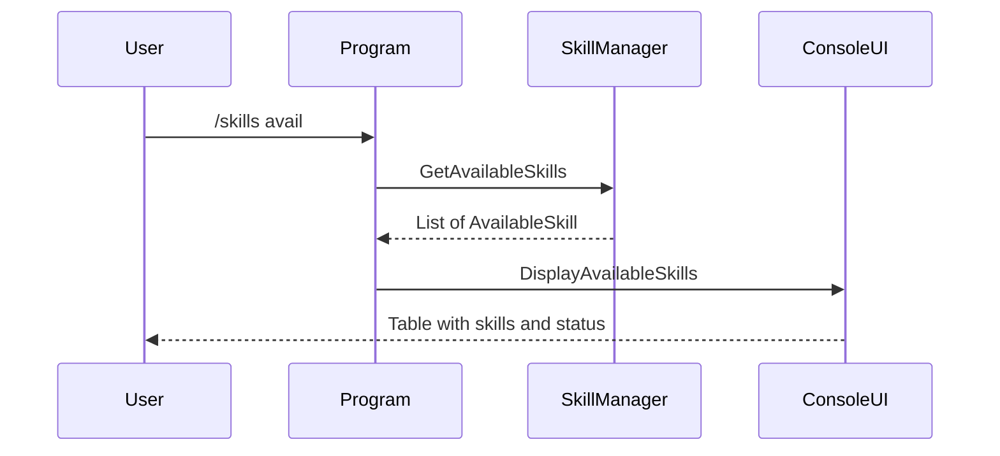
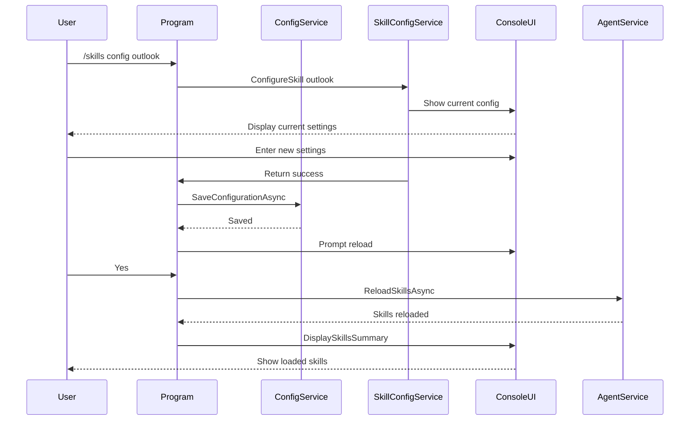

# Skill Configuration Implementation Plan

This document outlines the implementation plan for skill configuration commands in Microbot.

## Overview

The goal is to implement two new commands:
- **`/skills avail`** - Shows all available skills with their current status (enabled/disabled)
- **`/skills config <skillname>`** - Runs an interactive wizard to configure a specific skill

## Requirements

1. Show a hardcoded list of known skill types with their enabled/disabled status
2. Use interactive wizard for skill configuration (similar to first-time setup)
3. Focus on Outlook skill configuration for now (MCP/NuGet configuration will be added later)
4. Configuration changes should be saved to `Microbot.config`
5. If a skill is already configured, running `/skills config` should override the existing configuration

## Architecture

```mermaid
graph TB
    subgraph Console Commands
        SkillsAvail[/skills avail]
        SkillsConfig[/skills config skillname]
    end

    subgraph Skill Registry
        AvailableSkills[Available Skills List]
        OutlookSkillDef[Outlook Skill Definition]
        FutureSkills[Future Skills...]
    end

    subgraph Configuration Wizards
        OutlookWizard[Outlook Configuration Wizard]
        FutureWizards[Future Wizards...]
    end

    subgraph Services
        ConfigService[ConfigurationService]
        UIService[ConsoleUIService]
    end

    SkillsAvail --> AvailableSkills
    SkillsAvail --> UIService
    SkillsConfig --> OutlookWizard
    OutlookWizard --> ConfigService
    OutlookWizard --> UIService
```

## Implementation Details

### Phase 1: Define Available Skills Model

Create a new model in `Microbot.Core/Models/AvailableSkill.cs`:

```csharp
namespace Microbot.Core.Models;

/// <summary>
/// Represents an available skill that can be configured.
/// </summary>
public class AvailableSkill
{
    /// <summary>
    /// Unique identifier for the skill (e.g., "outlook", "mcp", "nuget").
    /// </summary>
    public string Id { get; set; } = string.Empty;

    /// <summary>
    /// Display name for the skill.
    /// </summary>
    public string Name { get; set; } = string.Empty;

    /// <summary>
    /// Description of what the skill provides.
    /// </summary>
    public string Description { get; set; } = string.Empty;

    /// <summary>
    /// Whether the skill is currently enabled in the configuration.
    /// </summary>
    public bool IsEnabled { get; set; }

    /// <summary>
    /// Whether the skill is properly configured (has all required settings).
    /// </summary>
    public bool IsConfigured { get; set; }

    /// <summary>
    /// Current configuration summary (e.g., "Mode: ReadOnly").
    /// </summary>
    public string? ConfigurationSummary { get; set; }

    /// <summary>
    /// The type of skill (BuiltIn, MCP, NuGet).
    /// </summary>
    public SkillType Type { get; set; }
}

/// <summary>
/// Types of skills supported by Microbot.
/// </summary>
public enum SkillType
{
    /// <summary>
    /// Built-in skills like Outlook.
    /// </summary>
    BuiltIn,

    /// <summary>
    /// MCP server-based skills.
    /// </summary>
    MCP,

    /// <summary>
    /// NuGet package-based skills.
    /// </summary>
    NuGet
}
```

### Phase 2: Add Skill Registry to SkillManager

Update `Microbot.Skills/SkillManager.cs` to include a method for getting available skills:

```csharp
/// <summary>
/// Gets a list of all available skills with their current status.
/// </summary>
/// <returns>List of available skills.</returns>
public IEnumerable<AvailableSkill> GetAvailableSkills()
{
    var skills = new List<AvailableSkill>();

    // Built-in: Outlook skill
    skills.Add(new AvailableSkill
    {
        Id = "outlook",
        Name = "Outlook",
        Description = "Microsoft Outlook integration for email and calendar via Microsoft Graph API",
        Type = SkillType.BuiltIn,
        IsEnabled = _config.Outlook?.Enabled ?? false,
        IsConfigured = !string.IsNullOrEmpty(_config.Outlook?.ClientId),
        ConfigurationSummary = _config.Outlook?.Enabled == true
            ? $"Mode: {_config.Outlook.Mode}, Auth: {_config.Outlook.AuthenticationMethod}"
            : null
    });

    // Future: Add more built-in skills here

    return skills;
}
```

### Phase 3: Update ConsoleUIService

Add a new method to display available skills in `Microbot.Console/Services/ConsoleUIService.cs`:

```csharp
/// <summary>
/// Displays the list of available skills with their status.
/// </summary>
/// <param name="skills">The available skills to display.</param>
public void DisplayAvailableSkills(IEnumerable<AvailableSkill> skills)
{
    var skillList = skills.ToList();

    var table = new Table()
        .Border(TableBorder.Rounded)
        .BorderColor(Color.Grey)
        .AddColumn(new TableColumn("[cyan]Skill[/]").LeftAligned())
        .AddColumn(new TableColumn("[cyan]Type[/]").Centered())
        .AddColumn(new TableColumn("[cyan]Status[/]").Centered())
        .AddColumn(new TableColumn("[cyan]Configuration[/]").LeftAligned());

    foreach (var skill in skillList)
    {
        var status = skill.IsEnabled
            ? "[green]Enabled[/]"
            : skill.IsConfigured
                ? "[yellow]Disabled[/]"
                : "[grey]Not Configured[/]";

        var config = skill.ConfigurationSummary ?? "[grey]-[/]";

        table.AddRow(
            $"[white]{skill.Name}[/]\n[grey]{skill.Description}[/]",
            $"[blue]{skill.Type}[/]",
            status,
            config
        );
    }

    AnsiConsole.Write(new Panel(table)
    {
        Header = new PanelHeader("[cyan]Available Skills[/]"),
        Border = BoxBorder.Rounded,
        Padding = new Padding(1, 0)
    });
    AnsiConsole.WriteLine();
    AnsiConsole.MarkupLine("[grey]Use [cyan]/skills config <skillname>[/] to configure a skill.[/]");
    AnsiConsole.WriteLine();
}
```

### Phase 4: Create Skill Configuration Wizard Infrastructure

Create a new file `Microbot.Console/Services/SkillConfigurationService.cs`:

```csharp
namespace Microbot.Console.Services;

using Microbot.Core.Models;
using Spectre.Console;

/// <summary>
/// Service for configuring skills through interactive wizards.
/// </summary>
public class SkillConfigurationService
{
    private readonly ConsoleUIService _ui;

    public SkillConfigurationService(ConsoleUIService ui)
    {
        _ui = ui;
    }

    /// <summary>
    /// Configures a skill by its ID.
    /// </summary>
    /// <param name="skillId">The skill ID to configure.</param>
    /// <param name="config">The current configuration to update.</param>
    /// <returns>True if configuration was successful, false if cancelled.</returns>
    public bool ConfigureSkill(string skillId, MicrobotConfig config)
    {
        return skillId.ToLowerInvariant() switch
        {
            "outlook" => ConfigureOutlookSkill(config),
            _ => HandleUnknownSkill(skillId)
        };
    }

    /// <summary>
    /// Configures the Outlook skill.
    /// </summary>
    private bool ConfigureOutlookSkill(MicrobotConfig config)
    {
        AnsiConsole.Write(new Rule("[cyan]Outlook Skill Configuration[/]").RuleStyle("grey"));
        AnsiConsole.WriteLine();

        // Show current configuration if exists
        if (config.Skills.Outlook?.Enabled == true)
        {
            AnsiConsole.MarkupLine("[yellow]Outlook skill is currently configured:[/]");
            AnsiConsole.MarkupLine($"  Mode: [cyan]{config.Skills.Outlook.Mode}[/]");
            AnsiConsole.MarkupLine($"  Client ID: [cyan]{MaskString(config.Skills.Outlook.ClientId)}[/]");
            AnsiConsole.MarkupLine($"  Auth Method: [cyan]{config.Skills.Outlook.AuthenticationMethod}[/]");
            AnsiConsole.WriteLine();

            if (!AnsiConsole.Confirm("[yellow]Do you want to reconfigure?[/]", false))
            {
                return false;
            }
        }

        // Enable/Disable
        var enable = AnsiConsole.Confirm(
            "[cyan]Enable Outlook skill?[/] (requires Azure AD app registration)",
            config.Skills.Outlook?.Enabled ?? false);

        if (!enable)
        {
            config.Skills.Outlook.Enabled = false;
            _ui.DisplaySuccess("Outlook skill disabled.");
            return true;
        }

        config.Skills.Outlook.Enabled = true;

        // Mode selection
        var mode = _ui.SelectOption(
            "Select Outlook skill [green]permission mode[/]:",
            new[] { "ReadOnly", "ReadWriteCalendar", "Full" });
        config.Skills.Outlook.Mode = mode;

        // Display mode description
        var modeDescription = mode switch
        {
            "ReadOnly" => "Read emails and calendar events only",
            "ReadWriteCalendar" => "Read emails, read/write calendar events",
            "Full" => "Read/send emails, read/write calendar events",
            _ => ""
        };
        _ui.DisplayInfo($"Mode: {modeDescription}");
        AnsiConsole.WriteLine();

        // Client ID
        var currentClientId = config.Skills.Outlook.ClientId;
        var clientIdPrompt = string.IsNullOrEmpty(currentClientId)
            ? "Enter your Azure AD Application (Client) ID:"
            : $"Enter your Azure AD Application (Client) ID (current: {MaskString(currentClientId)}):";
        
        config.Skills.Outlook.ClientId = _ui.PromptText(
            clientIdPrompt,
            currentClientId);

        // Tenant ID
        config.Skills.Outlook.TenantId = _ui.PromptText(
            "Enter your Tenant ID (or 'common' for multi-tenant):",
            config.Skills.Outlook.TenantId ?? "common");

        // Authentication method
        var authMethod = _ui.SelectOption(
            "Select authentication method:",
            new[] { "DeviceCode", "InteractiveBrowser" });
        config.Skills.Outlook.AuthenticationMethod = authMethod;

        if (authMethod == "InteractiveBrowser")
        {
            config.Skills.Outlook.RedirectUri = _ui.PromptText(
                "Enter Redirect URI:",
                config.Skills.Outlook.RedirectUri ?? "http://localhost");
        }

        _ui.DisplaySuccess("Outlook skill configured!");
        _ui.DisplayInfo("Note: You will be prompted to authenticate when the skill is first used.");
        AnsiConsole.WriteLine();

        return true;
    }

    private bool HandleUnknownSkill(string skillId)
    {
        _ui.DisplayError($"Unknown skill: '{skillId}'");
        _ui.DisplayInfo("Use /skills avail to see available skills.");
        return false;
    }

    private static string MaskString(string? value)
    {
        if (string.IsNullOrEmpty(value)) return "(not set)";
        if (value.Length <= 8) return "****";
        return value[..4] + "****" + value[^4..];
    }
}
```

### Phase 5: Update Program.cs Command Handler

Update the `HandleCommandAsync` method in `Program.cs`:

```csharp
private static async Task<bool> HandleCommandAsync(string command)
{
    var parts = command.Split(' ', StringSplitOptions.RemoveEmptyEntries);
    var cmd = parts[0].ToLowerInvariant();

    switch (cmd)
    {
        case "/help":
            _ui.DisplayHelp();
            break;

        case "/skills":
            await HandleSkillsCommandAsync(parts);
            break;

        case "/clear":
            _ui.DisplayHeader();
            _agentService.ClearHistory();
            _ui.DisplaySuccess("Screen and chat history cleared");
            break;

        case "/config":
            DisplayCurrentConfig();
            break;

        case "/history":
            _ui.DisplayInfo($"Chat history contains {_agentService.GetHistoryCount()} messages");
            break;

        case "/reload":
            await _ui.WithSpinnerAsync("Reloading configuration...", async () =>
            {
                _config = await _configService.LoadConfigurationAsync();
            });
            _ui.DisplaySuccess("Configuration reloaded");
            break;

        case "/exit":
        case "/quit":
            return false;

        default:
            _ui.DisplayWarning($"Unknown command: {cmd}. Type /help for available commands.");
            break;
    }

    return true;
}

/// <summary>
/// Handles /skills subcommands.
/// </summary>
private static async Task HandleSkillsCommandAsync(string[] parts)
{
    if (parts.Length < 2)
    {
        // Default: show loaded skills (existing behavior)
        if (_agentService.SkillManager != null)
        {
            _ui.DisplaySkillsSummary(_agentService.SkillManager.GetSkillSummaries());
        }
        else
        {
            _ui.DisplayWarning("No skills loaded");
        }
        return;
    }

    var subCommand = parts[1].ToLowerInvariant();

    switch (subCommand)
    {
        case "avail":
        case "available":
            DisplayAvailableSkills();
            break;

        case "config":
        case "configure":
            if (parts.Length < 3)
            {
                _ui.DisplayWarning("Usage: /skills config <skillname>");
                _ui.DisplayInfo("Example: /skills config outlook");
                return;
            }
            await ConfigureSkillAsync(parts[2]);
            break;

        default:
            // Treat as showing loaded skills (existing behavior)
            if (_agentService.SkillManager != null)
            {
                _ui.DisplaySkillsSummary(_agentService.SkillManager.GetSkillSummaries());
            }
            break;
    }
}

/// <summary>
/// Displays available skills.
/// </summary>
private static void DisplayAvailableSkills()
{
    if (_agentService.SkillManager != null)
    {
        var availableSkills = _agentService.SkillManager.GetAvailableSkills();
        _ui.DisplayAvailableSkills(availableSkills);
    }
    else
    {
        _ui.DisplayWarning("Skill manager not initialized");
    }
}

/// <summary>
/// Configures a skill interactively.
/// </summary>
private static async Task ConfigureSkillAsync(string skillId)
{
    var configService = new SkillConfigurationService(_ui);
    
    if (configService.ConfigureSkill(skillId, _config))
    {
        // Save the updated configuration
        await _configService.SaveConfigurationAsync(_config);
        _ui.DisplaySuccess("Configuration saved.");
        
        // Prompt to reload
        if (AnsiConsole.Confirm("[cyan]Would you like to reload skills now?[/]", true))
        {
            await _ui.WithSpinnerAsync("Reloading skills...", async () =>
            {
                await _agentService.ReloadSkillsAsync(_config, _cts.Token);
            });
            _ui.DisplaySuccess("Skills reloaded.");
            
            if (_agentService.SkillManager != null)
            {
                _ui.DisplaySkillsSummary(_agentService.SkillManager.GetSkillSummaries());
            }
        }
    }
}
```

### Phase 6: Update Help Display

Update the `DisplayHelp` method in `ConsoleUIService.cs`:

```csharp
public void DisplayHelp()
{
    var table = new Table()
        .Border(TableBorder.None)
        .HideHeaders()
        .AddColumn("Command")
        .AddColumn("Description");

    table.AddRow("[cyan]/help[/]", "Show this help message");
    table.AddRow("[cyan]/skills[/]", "List loaded skills");
    table.AddRow("[cyan]/skills avail[/]", "List all available skills with status");
    table.AddRow("[cyan]/skills config <name>[/]", "Configure a skill (e.g., /skills config outlook)");
    table.AddRow("[cyan]/clear[/]", "Clear the screen and chat history");
    table.AddRow("[cyan]/config[/]", "Show current configuration");
    table.AddRow("[cyan]/reload[/]", "Reload configuration from file");
    table.AddRow("[cyan]/exit[/]", "Exit the application");

    var panel = new Panel(table)
    {
        Header = new PanelHeader("[cyan]Available Commands[/]"),
        Border = BoxBorder.Rounded,
        Padding = new Padding(2, 1)
    };

    AnsiConsole.Write(panel);
    AnsiConsole.WriteLine();
}
```

### Phase 7: Add ReloadSkillsAsync to AgentService

Add a method to reload skills in `AgentService.cs`:

```csharp
/// <summary>
/// Reloads skills with updated configuration.
/// </summary>
public async Task ReloadSkillsAsync(MicrobotConfig config, CancellationToken cancellationToken = default)
{
    // Dispose existing skill manager
    if (_skillManager != null)
    {
        await _skillManager.DisposeAsync();
    }

    // Create new skill manager with updated config
    _skillManager = new SkillManager(
        config.Skills,
        _loggerFactory,
        _deviceCodeCallback);

    // Load skills
    await _skillManager.LoadAllSkillsAsync(cancellationToken);

    // Re-register with kernel
    if (_kernel != null)
    {
        // Clear existing plugins
        _kernel.Plugins.Clear();
        
        // Register new plugins
        _skillManager.RegisterPluginsWithKernel(_kernel);
    }
}
```

## File Changes Summary

| File | Action | Description |
|------|--------|-------------|
| `Microbot.Core/Models/AvailableSkill.cs` | Create | New model for available skills |
| `Microbot.Skills/SkillManager.cs` | Update | Add `GetAvailableSkills()` method |
| `Microbot.Console/Services/ConsoleUIService.cs` | Update | Add `DisplayAvailableSkills()` method, update `DisplayHelp()` |
| `Microbot.Console/Services/SkillConfigurationService.cs` | Create | New service for skill configuration wizards |
| `Microbot.Console/Services/AgentService.cs` | Update | Add `ReloadSkillsAsync()` method |
| `Microbot.Console/Program.cs` | Update | Add `/skills avail` and `/skills config` command handlers |
| `plans/implementation-plan.md` | Update | Add Phase 8 for skill configuration |

## Command Flow

### `/skills avail` Flow



### `/skills config outlook` Flow



## Testing Scenarios

1. **`/skills avail` with no skills configured**
   - Should show Outlook as "Not Configured"

2. **`/skills avail` with Outlook configured but disabled**
   - Should show Outlook as "Disabled" with configuration summary

3. **`/skills avail` with Outlook enabled**
   - Should show Outlook as "Enabled" with configuration summary

4. **`/skills config outlook` - first time**
   - Should run full wizard
   - Should save configuration
   - Should prompt to reload

5. **`/skills config outlook` - reconfigure**
   - Should show current configuration
   - Should ask for confirmation to reconfigure
   - Should allow updating settings
   - Should save and reload

6. **`/skills config unknown`**
   - Should show error message
   - Should suggest using `/skills avail`

## Future Enhancements

1. **MCP Server Configuration** - Add `/skills config mcp` to add/edit MCP servers
2. **NuGet Skill Configuration** - Add `/skills config nuget` to add/edit NuGet skills
3. **Skill Registry** - Implement a catalog of available skills that can be discovered
4. **Skill Templates** - Pre-configured skill templates for common use cases
5. **Skill Dependencies** - Handle skill dependencies and prerequisites
