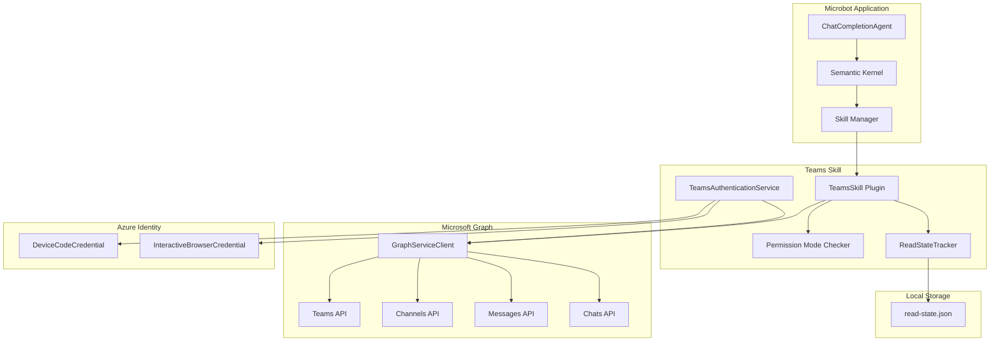

# Teams Skill Implementation Plan

This document provides a detailed implementation plan for the Microsoft Teams skill in Microbot.

## Overview

The Teams skill enables Microbot to interact with Microsoft Teams via the Microsoft Graph API. It supports two permission modes and multi-tenant access for users who are guests in other organizations.

| Mode | Capabilities |
|------|-------------|
| **ReadOnly** | Read teams, channels, channel messages, chats, chat messages |
| **Full** | ReadOnly + send messages to channels and chats |

## Key Features

1. **Multi-Tenant Support**: Automatically discovers and accesses teams from all tenants (home + guest tenants)
2. **Unread Message Tracking**: Tracks last read timestamps locally to identify new/unread messages
3. **Channel Messages**: Read and send messages in team channels
4. **Chat Messages**: Read and send messages in 1:1 and group chats
5. **Permission Modes**: ReadOnly and Full modes for different access levels

## Architecture



## Prerequisites

### Azure AD App Registration

Before using the Teams skill, you need to register an application in Azure AD/Entra ID:

1. Go to [Azure Portal](https://portal.azure.com) > Azure Active Directory > App registrations
2. Click **New registration**
3. Configure the application:
   - **Name**: `Microbot Teams Skill`
   - **Supported account types**: **Accounts in any organizational directory (Any Azure AD directory - Multitenant)** - Required for multi-tenant/guest access
   - **Redirect URI**: 
     - For Interactive Browser: `http://localhost` (Web)
     - For Device Code: Leave empty
4. After creation, note the **Application (client) ID**
5. Go to **Authentication** > **Advanced settings**:
   - Enable **Allow public client flows** (required for Device Code)
6. Go to **API permissions** > **Add a permission** > **Microsoft Graph**:
   - Add **Delegated permissions** based on mode:

| Permission | ReadOnly | Full | Description |
|------------|----------|------|-------------|
| `User.Read` | ✅ | ✅ | Read user profile |
| `Team.ReadBasic.All` | ✅ | ✅ | Read teams the user is a member of |
| `Channel.ReadBasic.All` | ✅ | ✅ | Read channel names and descriptions |
| `ChannelMessage.Read.All` | ✅ | ✅ | Read channel messages |
| `Chat.Read` | ✅ | ✅ | Read 1:1 and group chat messages |
| `ChannelMessage.Send` | ❌ | ✅ | Send messages to channels |
| `Chat.ReadWrite` | ❌ | ✅ | Send messages to chats |

7. Click **Grant admin consent** if required by your organization

**Note**: For multi-tenant access, the app registration must be configured as multi-tenant. Guest users will authenticate against their home tenant but can access resources in guest tenants.

## Project Structure

```
src/
├── Microbot.Skills.Teams/              # New project
│   ├── Microbot.Skills.Teams.csproj
│   ├── TeamsSkill.cs                   # Main skill with KernelFunctions
│   ├── TeamsSkillMode.cs               # Permission mode enum
│   ├── Services/
│   │   ├── TeamsAuthenticationService.cs
│   │   └── ReadStateTracker.cs         # Tracks last read timestamps
│   └── Models/
│       ├── TeamInfo.cs
│       ├── ChannelInfo.cs
│       ├── ChannelMessage.cs
│       ├── ChatInfo.cs
│       ├── ChatMessage.cs
│       └── ReadState.cs
├── Microbot.Core/
│   └── Models/
│       └── MicrobotConfig.cs           # Updated with TeamsSkillConfig
└── Microbot.Skills/
    ├── SkillManager.cs                 # Updated to load Teams skill
    └── Loaders/
        └── TeamsSkillLoader.cs         # New loader
```

## Implementation Details

### Phase 1: Project Setup and Configuration

#### Step 1.1: Create Microbot.Skills.Teams Project

```bash
cd src
dotnet new classlib -n Microbot.Skills.Teams -o Microbot.Skills.Teams
cd ..
dotnet sln add src/Microbot.Skills.Teams/Microbot.Skills.Teams.csproj
```

#### Step 1.2: Project File

**Microbot.Skills.Teams.csproj:**
```xml
<Project Sdk="Microsoft.NET.Sdk">

  <PropertyGroup>
    <TargetFramework>net10.0</TargetFramework>
    <ImplicitUsings>enable</ImplicitUsings>
    <Nullable>enable</Nullable>
  </PropertyGroup>

  <ItemGroup>
    <ProjectReference Include="..\Microbot.Core\Microbot.Core.csproj" />
  </ItemGroup>

  <ItemGroup>
    <PackageReference Include="Azure.Identity" Version="1.13.2" />
    <PackageReference Include="Microsoft.Graph" Version="5.78.0" />
    <PackageReference Include="Microsoft.SemanticKernel" Version="1.70.0" />
    <PackageReference Include="Microsoft.Extensions.Logging.Abstractions" Version="10.0.2" />
  </ItemGroup>

</Project>
```

#### Step 1.3: Define TeamsSkillMode Enum

**TeamsSkillMode.cs:**
```csharp
namespace Microbot.Skills.Teams;

/// <summary>
/// Defines the permission mode for the Teams skill.
/// </summary>
public enum TeamsSkillMode
{
    /// <summary>
    /// Read-only access to teams, channels, and messages.
    /// Permissions: User.Read, Team.ReadBasic.All, Channel.ReadBasic.All, 
    ///              ChannelMessage.Read.All, Chat.Read
    /// </summary>
    ReadOnly,

    /// <summary>
    /// Full access: read and send messages to channels and chats.
    /// Permissions: All ReadOnly permissions + ChannelMessage.Send, Chat.ReadWrite
    /// </summary>
    Full
}
```

#### Step 1.4: Update MicrobotConfig

Add to **MicrobotConfig.cs** in `Microbot.Core/Models/`:

```csharp
/// <summary>
/// Configuration for the Teams skill.
/// </summary>
public class TeamsSkillConfig
{
    /// <summary>
    /// Whether the Teams skill is enabled.
    /// </summary>
    public bool Enabled { get; set; } = false;

    /// <summary>
    /// The permission mode for the Teams skill: "ReadOnly" or "Full".
    /// </summary>
    public string Mode { get; set; } = "ReadOnly";

    /// <summary>
    /// Azure AD Application (client) ID.
    /// </summary>
    public string? ClientId { get; set; }

    /// <summary>
    /// Azure AD Tenant ID. Use "common" for multi-tenant access (required for guest access).
    /// </summary>
    public string TenantId { get; set; } = "common";

    /// <summary>
    /// Authentication method: "DeviceCode" or "InteractiveBrowser".
    /// </summary>
    public string AuthenticationMethod { get; set; } = "DeviceCode";

    /// <summary>
    /// Redirect URI for Interactive Browser authentication.
    /// </summary>
    public string RedirectUri { get; set; } = "http://localhost";

    /// <summary>
    /// Path to store read state (last read timestamps).
    /// </summary>
    public string ReadStatePath { get; set; } = "./teams-read-state.json";
}
```

Update **SkillsConfig** class:
```csharp
public class SkillsConfig
{
    // ... existing properties ...

    /// <summary>
    /// Teams skill configuration.
    /// </summary>
    public TeamsSkillConfig Teams { get; set; } = new();
}
```

### Phase 2: Model Classes

#### Step 2.1: TeamInfo Model

**Models/TeamInfo.cs:**
```csharp
namespace Microbot.Skills.Teams.Models;

/// <summary>
/// Represents a Microsoft Teams team.
/// </summary>
public class TeamInfo
{
    public string Id { get; set; } = string.Empty;
    public string DisplayName { get; set; } = string.Empty;
    public string Description { get; set; } = string.Empty;
    public string TenantId { get; set; } = string.Empty;
    public bool IsArchived { get; set; }
    public bool IsGuest { get; set; }
}
```

#### Step 2.2: ChannelInfo Model

**Models/ChannelInfo.cs:**
```csharp
namespace Microbot.Skills.Teams.Models;

/// <summary>
/// Represents a channel in a Microsoft Teams team.
/// </summary>
public class ChannelInfo
{
    public string Id { get; set; } = string.Empty;
    public string TeamId { get; set; } = string.Empty;
    public string DisplayName { get; set; } = string.Empty;
    public string Description { get; set; } = string.Empty;
    public string MembershipType { get; set; } = string.Empty; // standard, private, shared
}
```

#### Step 2.3: ChannelMessage Model

**Models/ChannelMessage.cs:**
```csharp
namespace Microbot.Skills.Teams.Models;

/// <summary>
/// Represents a message in a Teams channel.
/// </summary>
public class ChannelMessage
{
    public string Id { get; set; } = string.Empty;
    public string TeamId { get; set; } = string.Empty;
    public string TeamName { get; set; } = string.Empty;
    public string ChannelId { get; set; } = string.Empty;
    public string ChannelName { get; set; } = string.Empty;
    public string Content { get; set; } = string.Empty;
    public string ContentType { get; set; } = string.Empty; // text, html
    public string FromUserId { get; set; } = string.Empty;
    public string FromUserDisplayName { get; set; } = string.Empty;
    public DateTime CreatedDateTime { get; set; }
    public DateTime? LastModifiedDateTime { get; set; }
    public bool IsUnread { get; set; }
    public int ReplyCount { get; set; }
    public string? Subject { get; set; }
}
```

#### Step 2.4: ChatInfo Model

**Models/ChatInfo.cs:**
```csharp
namespace Microbot.Skills.Teams.Models;

/// <summary>
/// Represents a 1:1 or group chat.
/// </summary>
public class ChatInfo
{
    public string Id { get; set; } = string.Empty;
    public string ChatType { get; set; } = string.Empty; // oneOnOne, group, meeting
    public string Topic { get; set; } = string.Empty;
    public DateTime CreatedDateTime { get; set; }
    public DateTime? LastUpdatedDateTime { get; set; }
    public List<string> Members { get; set; } = [];
    public int UnreadCount { get; set; }
}
```

#### Step 2.5: ChatMessage Model

**Models/ChatMessage.cs:**
```csharp
namespace Microbot.Skills.Teams.Models;

/// <summary>
/// Represents a message in a 1:1 or group chat.
/// </summary>
public class ChatMessage
{
    public string Id { get; set; } = string.Empty;
    public string ChatId { get; set; } = string.Empty;
    public string ChatTopic { get; set; } = string.Empty;
    public string Content { get; set; } = string.Empty;
    public string ContentType { get; set; } = string.Empty; // text, html
    public string FromUserId { get; set; } = string.Empty;
    public string FromUserDisplayName { get; set; } = string.Empty;
    public DateTime CreatedDateTime { get; set; }
    public DateTime? LastModifiedDateTime { get; set; }
    public bool IsUnread { get; set; }
}
```

#### Step 2.6: ReadState Model

**Models/ReadState.cs:**
```csharp
namespace Microbot.Skills.Teams.Models;

/// <summary>
/// Tracks the last read timestamps for channels and chats.
/// </summary>
public class ReadState
{
    /// <summary>
    /// Last read timestamp per channel (key: "teamId:channelId").
    /// </summary>
    public Dictionary<string, DateTime> ChannelLastRead { get; set; } = [];

    /// <summary>
    /// Last read timestamp per chat (key: chatId).
    /// </summary>
    public Dictionary<string, DateTime> ChatLastRead { get; set; } = [];

    /// <summary>
    /// Last time the read state was updated.
    /// </summary>
    public DateTime LastUpdated { get; set; } = DateTime.UtcNow;
}
```

### Phase 3: Services

#### Step 3.1: ReadStateTracker Service

**Services/ReadStateTracker.cs:**
```csharp
namespace Microbot.Skills.Teams.Services;

using System.Text.Json;
using Microbot.Skills.Teams.Models;

/// <summary>
/// Tracks and persists the last read timestamps for channels and chats.
/// </summary>
public class ReadStateTracker
{
    private readonly string _statePath;
    private ReadState _state;
    private readonly JsonSerializerOptions _jsonOptions;

    public ReadStateTracker(string statePath)
    {
        _statePath = statePath;
        _jsonOptions = new JsonSerializerOptions { WriteIndented = true };
        _state = LoadState();
    }

    private ReadState LoadState()
    {
        if (File.Exists(_statePath))
        {
            try
            {
                var json = File.ReadAllText(_statePath);
                return JsonSerializer.Deserialize<ReadState>(json, _jsonOptions) ?? new ReadState();
            }
            catch
            {
                return new ReadState();
            }
        }
        return new ReadState();
    }

    private void SaveState()
    {
        _state.LastUpdated = DateTime.UtcNow;
        var json = JsonSerializer.Serialize(_state, _jsonOptions);
        File.WriteAllText(_statePath, json);
    }

    /// <summary>
    /// Gets the last read timestamp for a channel.
    /// </summary>
    public DateTime? GetChannelLastRead(string teamId, string channelId)
    {
        var key = $"{teamId}:{channelId}";
        return _state.ChannelLastRead.TryGetValue(key, out var timestamp) ? timestamp : null;
    }

    /// <summary>
    /// Updates the last read timestamp for a channel.
    /// </summary>
    public void SetChannelLastRead(string teamId, string channelId, DateTime timestamp)
    {
        var key = $"{teamId}:{channelId}";
        _state.ChannelLastRead[key] = timestamp;
        SaveState();
    }

    /// <summary>
    /// Gets the last read timestamp for a chat.
    /// </summary>
    public DateTime? GetChatLastRead(string chatId)
    {
        return _state.ChatLastRead.TryGetValue(chatId, out var timestamp) ? timestamp : null;
    }

    /// <summary>
    /// Updates the last read timestamp for a chat.
    /// </summary>
    public void SetChatLastRead(string chatId, DateTime timestamp)
    {
        _state.ChatLastRead[chatId] = timestamp;
        SaveState();
    }

    /// <summary>
    /// Marks all messages in a channel as read up to the specified timestamp.
    /// </summary>
    public void MarkChannelAsRead(string teamId, string channelId, DateTime? upToTimestamp = null)
    {
        SetChannelLastRead(teamId, channelId, upToTimestamp ?? DateTime.UtcNow);
    }

    /// <summary>
    /// Marks all messages in a chat as read up to the specified timestamp.
    /// </summary>
    public void MarkChatAsRead(string chatId, DateTime? upToTimestamp = null)
    {
        SetChatLastRead(chatId, upToTimestamp ?? DateTime.UtcNow);
    }

    /// <summary>
    /// Checks if a message is unread based on its creation time.
    /// </summary>
    public bool IsChannelMessageUnread(string teamId, string channelId, DateTime messageCreatedDateTime)
    {
        var lastRead = GetChannelLastRead(teamId, channelId);
        return lastRead == null || messageCreatedDateTime > lastRead;
    }

    /// <summary>
    /// Checks if a chat message is unread based on its creation time.
    /// </summary>
    public bool IsChatMessageUnread(string chatId, DateTime messageCreatedDateTime)
    {
        var lastRead = GetChatLastRead(chatId);
        return lastRead == null || messageCreatedDateTime > lastRead;
    }
}
```

#### Step 3.2: TeamsAuthenticationService

**Services/TeamsAuthenticationService.cs:**
```csharp
namespace Microbot.Skills.Teams.Services;

using Azure.Core;
using Azure.Identity;
using Microsoft.Extensions.Logging;
using Microsoft.Graph;
using Microbot.Core.Models;

/// <summary>
/// Handles authentication for the Teams skill using Azure Identity.
/// </summary>
public class TeamsAuthenticationService
{
    private readonly TeamsSkillConfig _config;
    private readonly ILogger<TeamsAuthenticationService>? _logger;
    private GraphServiceClient? _graphClient;

    public TeamsAuthenticationService(
        TeamsSkillConfig config,
        ILogger<TeamsAuthenticationService>? logger = null)
    {
        _config = config;
        _logger = logger;
    }

    /// <summary>
    /// Gets the scopes required for the configured mode.
    /// </summary>
    public string[] GetRequiredScopes()
    {
        var mode = Enum.Parse<TeamsSkillMode>(_config.Mode, ignoreCase: true);

        return mode switch
        {
            TeamsSkillMode.ReadOnly => new[]
            {
                "User.Read",
                "Team.ReadBasic.All",
                "Channel.ReadBasic.All",
                "ChannelMessage.Read.All",
                "Chat.Read"
            },
            TeamsSkillMode.Full => new[]
            {
                "User.Read",
                "Team.ReadBasic.All",
                "Channel.ReadBasic.All",
                "ChannelMessage.Read.All",
                "ChannelMessage.Send",
                "Chat.Read",
                "Chat.ReadWrite"
            },
            _ => throw new ArgumentException($"Unknown mode: {_config.Mode}")
        };
    }

    /// <summary>
    /// Creates and returns an authenticated GraphServiceClient.
    /// </summary>
    public async Task<GraphServiceClient> GetGraphClientAsync(
        Action<string>? deviceCodeCallback = null,
        CancellationToken cancellationToken = default)
    {
        if (_graphClient != null)
            return _graphClient;

        if (string.IsNullOrEmpty(_config.ClientId))
            throw new InvalidOperationException("ClientId is required for Teams skill");

        var scopes = GetRequiredScopes();

        _logger?.LogInformation(
            "Authenticating with method: {Method}, Scopes: {Scopes}",
            _config.AuthenticationMethod,
            string.Join(", ", scopes));

        TokenCredential credential = _config.AuthenticationMethod.ToLowerInvariant() switch
        {
            "devicecode" => CreateDeviceCodeCredential(deviceCodeCallback),
            "interactivebrowser" => CreateInteractiveBrowserCredential(),
            _ => throw new ArgumentException(
                $"Unknown authentication method: {_config.AuthenticationMethod}")
        };

        _graphClient = new GraphServiceClient(credential, scopes);

        // Verify authentication by getting user info
        var user = await _graphClient.Me.GetAsync(cancellationToken: cancellationToken);
        _logger?.LogInformation("Authenticated as: {User}", user?.DisplayName ?? user?.UserPrincipalName);

        return _graphClient;
    }

    private DeviceCodeCredential CreateDeviceCodeCredential(Action<string>? callback)
    {
        var options = new DeviceCodeCredentialOptions
        {
            ClientId = _config.ClientId,
            TenantId = _config.TenantId,
            DeviceCodeCallback = (info, ct) =>
            {
                var message = info.Message;
                _logger?.LogInformation("Device Code: {Message}", message);
                callback?.Invoke(message);
                return Task.CompletedTask;
            }
        };

        return new DeviceCodeCredential(options);
    }

    private InteractiveBrowserCredential CreateInteractiveBrowserCredential()
    {
        var options = new InteractiveBrowserCredentialOptions
        {
            ClientId = _config.ClientId,
            TenantId = _config.TenantId,
            RedirectUri = new Uri(_config.RedirectUri)
        };

        return new InteractiveBrowserCredential(options);
    }
}
```

### Phase 4: TeamsSkill Implementation

#### Step 4.1: TeamsSkill Class

**TeamsSkill.cs:**
```csharp
namespace Microbot.Skills.Teams;

using System.ComponentModel;
using System.Text.Json;
using Microsoft.Extensions.Logging;
using Microsoft.Graph;
using Microsoft.Graph.Models;
using Microsoft.SemanticKernel;
using Microbot.Core.Models;
using Microbot.Skills.Teams.Models;
using Microbot.Skills.Teams.Services;

/// <summary>
/// Teams skill providing team, channel, and chat functionality via Microsoft Graph.
/// Supports multi-tenant access for guest users.
/// </summary>
public class TeamsSkill
{
    private readonly TeamsSkillConfig _config;
    private readonly TeamsSkillMode _mode;
    private readonly TeamsAuthenticationService _authService;
    private readonly ReadStateTracker _readTracker;
    private readonly ILogger<TeamsSkill>? _logger;
    private GraphServiceClient? _graphClient;
    private readonly Action<string>? _deviceCodeCallback;
    private readonly JsonSerializerOptions _jsonOptions;

    public TeamsSkill(
        TeamsSkillConfig config,
        ILogger<TeamsSkill>? logger = null,
        Action<string>? deviceCodeCallback = null)
    {
        _config = config;
        _mode = Enum.Parse<TeamsSkillMode>(config.Mode, ignoreCase: true);
        _authService = new TeamsAuthenticationService(config,
            logger as ILogger<TeamsAuthenticationService>);
        _readTracker = new ReadStateTracker(config.ReadStatePath);
        _logger = logger;
        _deviceCodeCallback = deviceCodeCallback;
        _jsonOptions = new JsonSerializerOptions { WriteIndented = true };
    }

    private async Task<GraphServiceClient> GetClientAsync(CancellationToken ct = default)
    {
        _graphClient ??= await _authService.GetGraphClientAsync(_deviceCodeCallback, ct);
        return _graphClient;
    }

    private void EnsurePermission(TeamsSkillMode requiredMode, string operation)
    {
        if (_mode < requiredMode)
        {
            throw new InvalidOperationException(
                $"Operation '{operation}' requires {requiredMode} mode, " +
                $"but current mode is {_mode}. Please update your Teams skill configuration.");
        }
    }

    #region Teams and Channels (ReadOnly)

    [KernelFunction("list_teams")]
    [Description("Lists all Microsoft Teams the user is a member of, including teams from guest tenants. Returns team name, description, and tenant information.")]
    public async Task<string> ListTeamsAsync(
        [Description("Filter by tenant ID (optional, leave empty for all tenants)")]
        string? tenantId = null,
        [Description("Include archived teams (default: false)")]
        bool includeArchived = false,
        CancellationToken cancellationToken = default)
    {
        _logger?.LogInformation("Listing teams (tenantId: {TenantId}, includeArchived: {IncludeArchived})", 
            tenantId ?? "all", includeArchived);

        var client = await GetClientAsync(cancellationToken);

        // Get user's home tenant for comparison
        var user = await client.Me.GetAsync(cancellationToken: cancellationToken);
        var homeTenantId = user?.Id; // We'll use organization info for tenant

        var teams = await client.Me.JoinedTeams.GetAsync(cancellationToken: cancellationToken);

        var result = new List<TeamInfo>();
        
        if (teams?.Value != null)
        {
            foreach (var team in teams.Value)
            {
                // Filter by tenant if specified
                if (!string.IsNullOrEmpty(tenantId) && team.TenantId != tenantId)
                    continue;

                // Filter archived teams
                if (!includeArchived && (team.IsArchived ?? false))
                    continue;

                result.Add(new TeamInfo
                {
                    Id = team.Id ?? string.Empty,
                    DisplayName = team.DisplayName ?? string.Empty,
                    Description = team.Description ?? string.Empty,
                    TenantId = team.TenantId ?? string.Empty,
                    IsArchived = team.IsArchived ?? false,
                    IsGuest = team.TenantId != homeTenantId
                });
            }
        }

        _logger?.LogInformation("Found {Count} teams", result.Count);
        return JsonSerializer.Serialize(result, _jsonOptions);
    }

    [KernelFunction("list_channels")]
    [Description("Lists all channels in a specific team.")]
    public async Task<string> ListChannelsAsync(
        [Description("The ID of the team")]
        string teamId,
        CancellationToken cancellationToken = default)
    {
        _logger?.LogInformation("Listing channels for team: {TeamId}", teamId);

        var client = await GetClientAsync(cancellationToken);

        var channels = await client.Teams[teamId].Channels.GetAsync(cancellationToken: cancellationToken);

        var result = channels?.Value?.Select(c => new ChannelInfo
        {
            Id = c.Id ?? string.Empty,
            TeamId = teamId,
            DisplayName = c.DisplayName ?? string.Empty,
            Description = c.Description ?? string.Empty,
            MembershipType = c.MembershipType?.ToString() ?? "standard"
        }).ToList() ?? [];

        _logger?.LogInformation("Found {Count} channels", result.Count);
        return JsonSerializer.Serialize(result, _jsonOptions);
    }

    #endregion

    #region Channel Messages (ReadOnly)

    [KernelFunction("list_channel_messages")]
    [Description("Lists recent messages from a channel. Marks messages as unread if they are newer than the last read timestamp.")]
    public async Task<string> ListChannelMessagesAsync(
        [Description("The ID of the team")]
        string teamId,
        [Description("The ID of the channel")]
        string channelId,
        [Description("Maximum number of messages to return (default: 20, max: 50)")]
        int count = 20,
        [Description("Only return unread messages (default: false)")]
        bool unreadOnly = false,
        CancellationToken cancellationToken = default)
    {
        _logger?.LogInformation("Listing channel messages (team: {TeamId}, channel: {ChannelId}, count: {Count})", 
            teamId, channelId, count);

        var client = await GetClientAsync(cancellationToken);
        count = Math.Min(Math.Max(count, 1), 50);

        // Get team and channel names for context
        var team = await client.Teams[teamId].GetAsync(cancellationToken: cancellationToken);
        var channel = await client.Teams[teamId].Channels[channelId].GetAsync(cancellationToken: cancellationToken);

        var messages = await client.Teams[teamId].Channels[channelId].Messages.GetAsync(config =>
        {
            config.QueryParameters.Top = count;
            config.QueryParameters.Orderby = new[] { "createdDateTime desc" };
        }, cancellationToken);

        var result = new List<ChannelMessage>();

        if (messages?.Value != null)
        {
            foreach (var m in messages.Value)
            {
                var createdDateTime = m.CreatedDateTime?.DateTime ?? DateTime.MinValue;
                var isUnread = _readTracker.IsChannelMessageUnread(teamId, channelId, createdDateTime);

                if (unreadOnly && !isUnread)
                    continue;

                result.Add(new ChannelMessage
                {
                    Id = m.Id ?? string.Empty,
                    TeamId = teamId,
                    TeamName = team?.DisplayName ?? string.Empty,
                    ChannelId = channelId,
                    ChannelName = channel?.DisplayName ?? string.Empty,
                    Content = m.Body?.Content ?? string.Empty,
                    ContentType = m.Body?.ContentType?.ToString() ?? "text",
                    FromUserId = m.From?.User?.Id ?? string.Empty,
                    FromUserDisplayName = m.From?.User?.DisplayName ?? "Unknown",
                    CreatedDateTime = createdDateTime,
                    LastModifiedDateTime = m.LastModifiedDateTime?.DateTime,
                    IsUnread = isUnread,
                    ReplyCount = m.Replies?.Count ?? 0,
                    Subject = m.Subject
                });
            }
        }

        _logger?.LogInformation("Found {Count} messages ({Unread} unread)", 
            result.Count, result.Count(m => m.IsUnread));
        return JsonSerializer.Serialize(result, _jsonOptions);
    }

    [KernelFunction("get_unread_channel_messages")]
    [Description("Gets all unread messages across all teams and channels. Useful for checking what's new.")]
    public async Task<string> GetUnreadChannelMessagesAsync(
        [Description("Maximum messages per channel (default: 10, max: 20)")]
        int maxPerChannel = 10,
        CancellationToken cancellationToken = default)
    {
        _logger?.LogInformation("Getting unread channel messages across all teams");

        var client = await GetClientAsync(cancellationToken);
        maxPerChannel = Math.Min(Math.Max(maxPerChannel, 1), 20);

        var allUnread = new List<ChannelMessage>();

        // Get all teams
        var teams = await client.Me.JoinedTeams.GetAsync(cancellationToken: cancellationToken);

        if (teams?.Value != null)
        {
            foreach (var team in teams.Value.Where(t => !(t.IsArchived ?? false)))
            {
                try
                {
                    var channels = await client.Teams[team.Id].Channels.GetAsync(cancellationToken: cancellationToken);

                    if (channels?.Value != null)
                    {
                        foreach (var channel in channels.Value)
                        {
                            try
                            {
                                var messages = await client.Teams[team.Id].Channels[channel.Id].Messages.GetAsync(config =>
                                {
                                    config.QueryParameters.Top = maxPerChannel;
                                    config.QueryParameters.Orderby = new[] { "createdDateTime desc" };
                                }, cancellationToken);

                                if (messages?.Value != null)
                                {
                                    foreach (var m in messages.Value)
                                    {
                                        var createdDateTime = m.CreatedDateTime?.DateTime ?? DateTime.MinValue;
                                        if (_readTracker.IsChannelMessageUnread(team.Id!, channel.Id!, createdDateTime))
                                        {
                                            allUnread.Add(new ChannelMessage
                                            {
                                                Id = m.Id ?? string.Empty,
                                                TeamId = team.Id ?? string.Empty,
                                                TeamName = team.DisplayName ?? string.Empty,
                                                ChannelId = channel.Id ?? string.Empty,
                                                ChannelName = channel.DisplayName ?? string.Empty,
                                                Content = m.Body?.Content ?? string.Empty,
                                                ContentType = m.Body?.ContentType?.ToString() ?? "text",
                                                FromUserId = m.From?.User?.Id ?? string.Empty,
                                                FromUserDisplayName = m.From?.User?.DisplayName ?? "Unknown",
                                                CreatedDateTime = createdDateTime,
                                                IsUnread = true,
                                                Subject = m.Subject
                                            });
                                        }
                                    }
                                }
                            }
                            catch (Exception ex)
                            {
                                _logger?.LogWarning(ex, "Failed to get messages for channel {ChannelId}", channel.Id);
                            }
                        }
                    }
                }
                catch (Exception ex)
                {
                    _logger?.LogWarning(ex, "Failed to get channels for team {TeamId}", team.Id);
                }
            }
        }

        // Sort by creation time, newest first
        allUnread = allUnread.OrderByDescending(m => m.CreatedDateTime).ToList();

        _logger?.LogInformation("Found {Count} unread channel messages", allUnread.Count);
        return JsonSerializer.Serialize(allUnread, _jsonOptions);
    }

    [KernelFunction("mark_channel_as_read")]
    [Description("Marks all messages in a channel as read up to the current time or a specific message.")]
    public Task<string> MarkChannelAsReadAsync(
        [Description("The ID of the team")]
        string teamId,
        [Description("The ID of the channel")]
        string channelId,
        [Description("Optional: Mark as read up to this message ID (if not provided, marks all as read)")]
        string? upToMessageId = null,
        CancellationToken cancellationToken = default)
    {
        _logger?.LogInformation("Marking channel as read (team: {TeamId}, channel: {ChannelId})", teamId, channelId);

        _readTracker.MarkChannelAsRead(teamId, channelId);

        return Task.FromResult(JsonSerializer.Serialize(new
        {
            success = true,
            message = $"Channel marked as read"
        }, _jsonOptions));
    }

    #endregion

    #region Chats (ReadOnly)

    [KernelFunction("list_chats")]
    [Description("Lists all 1:1 and group chats the user is part of.")]
    public async Task<string> ListChatsAsync(
        [Description("Maximum number of chats to return (default: 20, max: 50)")]
        int count = 20,
        CancellationToken cancellationToken = default)
    {
        _logger?.LogInformation("Listing chats (count: {Count})", count);

        var client = await GetClientAsync(cancellationToken);
        count = Math.Min(Math.Max(count, 1), 50);

        var chats = await client.Me.Chats.GetAsync(config =>
        {
            config.QueryParameters.Top = count;
            config.QueryParameters.Expand = new[] { "members" };
            config.QueryParameters.Orderby = new[] { "lastUpdatedDateTime desc" };
        }, cancellationToken);

        var result = chats?.Value?.Select(c => new ChatInfo
        {
            Id = c.Id ?? string.Empty,
            ChatType = c.ChatType?.ToString() ?? "unknown",
            Topic = c.Topic ?? GetChatDisplayName(c),
            CreatedDateTime = c.CreatedDateTime?.DateTime ?? DateTime.MinValue,
            LastUpdatedDateTime = c.LastUpdatedDateTime?.DateTime,
            Members = c.Members?.Select(m => m.DisplayName ?? "Unknown").ToList() ?? []
        }).ToList() ?? [];

        _logger?.LogInformation("Found {Count} chats", result.Count);
        return JsonSerializer.Serialize(result, _jsonOptions);
    }

    private static string GetChatDisplayName(Chat chat)
    {
        if (!string.IsNullOrEmpty(chat.Topic))
            return chat.Topic;

        var members = chat.Members?.Select(m => m.DisplayName).Where(n => !string.IsNullOrEmpty(n)).ToList();
        if (members != null && members.Count > 0)
            return string.Join(", ", members.Take(3)) + (members.Count > 3 ? $" +{members.Count - 3}" : "");

        return chat.ChatType?.ToString() ?? "Chat";
    }

    [KernelFunction("list_chat_messages")]
    [Description("Lists recent messages from a specific chat.")]
    public async Task<string> ListChatMessagesAsync(
        [Description("The ID of the chat")]
        string chatId,
        [Description("Maximum number of messages to return (default: 20, max: 50)")]
        int count = 20,
        [Description("Only return unread messages (default: false)")]
        bool unreadOnly = false,
        CancellationToken cancellationToken = default)
    {
        _logger?.LogInformation("Listing chat messages (chat: {ChatId}, count: {Count})", chatId, count);

        var client = await GetClientAsync(cancellationToken);
        count = Math.Min(Math.Max(count, 1), 50);

        // Get chat info for context
        var chat = await client.Me.Chats[chatId].GetAsync(config =>
        {
            config.QueryParameters.Expand = new[] { "members" };
        }, cancellationToken);

        var messages = await client.Me.Chats[chatId].Messages.GetAsync(config =>
        {
            config.QueryParameters.Top = count;
            config.QueryParameters.Orderby = new[] { "createdDateTime desc" };
        }, cancellationToken);

        var result = new List<ChatMessage>();

        if (messages?.Value != null)
        {
            foreach (var m in messages.Value)
            {
                var createdDateTime = m.CreatedDateTime?.DateTime ?? DateTime.MinValue;
                var isUnread = _readTracker.IsChatMessageUnread(chatId, createdDateTime);

                if (unreadOnly && !isUnread)
                    continue;

                result.Add(new ChatMessage
                {
                    Id = m.Id ?? string.Empty,
                    ChatId = chatId,
                    ChatTopic = chat?.Topic ?? GetChatDisplayName(chat!),
                    Content = m.Body?.Content ?? string.Empty,
                    ContentType = m.Body?.ContentType?.ToString() ?? "text",
                    FromUserId = m.From?.User?.Id ?? string.Empty,
                    FromUserDisplayName = m.From?.User?.DisplayName ?? "Unknown",
                    CreatedDateTime = createdDateTime,
                    LastModifiedDateTime = m.LastModifiedDateTime?.DateTime,
                    IsUnread = isUnread
                });
            }
        }

        _logger?.LogInformation("Found {Count} messages ({Unread} unread)", 
            result.Count, result.Count(m => m.IsUnread));
        return JsonSerializer.Serialize(result, _jsonOptions);
    }

    [KernelFunction("get_unread_chat_messages")]
    [Description("Gets all unread messages across all chats. Useful for checking what's new.")]
    public async Task<string> GetUnreadChatMessagesAsync(
        [Description("Maximum messages per chat (default: 10, max: 20)")]
        int maxPerChat = 10,
        CancellationToken cancellationToken = default)
    {
        _logger?.LogInformation("Getting unread chat messages across all chats");

        var client = await GetClientAsync(cancellationToken);
        maxPerChat = Math.Min(Math.Max(maxPerChat, 1), 20);

        var allUnread = new List<ChatMessage>();

        var chats = await client.Me.Chats.GetAsync(config =>
        {
            config.QueryParameters.Top = 50;
            config.QueryParameters.Expand = new[] { "members" };
        }, cancellationToken);

        if (chats?.Value != null)
        {
            foreach (var chat in chats.Value)
            {
                try
                {
                    var messages = await client.Me.Chats[chat.Id].Messages.GetAsync(config =>
                    {
                        config.QueryParameters.Top = maxPerChat;
                        config.QueryParameters.Orderby = new[] { "createdDateTime desc" };
                    }, cancellationToken);

                    if (messages?.Value != null)
                    {
                        foreach (var m in messages.Value)
                        {
                            var createdDateTime = m.CreatedDateTime?.DateTime ?? DateTime.MinValue;
                            if (_readTracker.IsChatMessageUnread(chat.Id!, createdDateTime))
                            {
                                allUnread.Add(new ChatMessage
                                {
                                    Id = m.Id ?? string.Empty,
                                    ChatId = chat.Id ?? string.Empty,
                                    ChatTopic = chat.Topic ?? GetChatDisplayName(chat),
                                    Content = m.Body?.Content ?? string.Empty,
                                    ContentType = m.Body?.ContentType?.ToString() ?? "text",
                                    FromUserId = m.From?.User?.Id ?? string.Empty,
                                    FromUserDisplayName = m.From?.User?.DisplayName ?? "Unknown",
                                    CreatedDateTime = createdDateTime,
                                    IsUnread = true
                                });
                            }
                        }
                    }
                }
                catch (Exception ex)
                {
                    _logger?.LogWarning(ex, "Failed to get messages for chat {ChatId}", chat.Id);
                }
            }
        }

        // Sort by creation time, newest first
        allUnread = allUnread.OrderByDescending(m => m.CreatedDateTime).ToList();

        _logger?.LogInformation("Found {Count} unread chat messages", allUnread.Count);
        return JsonSerializer.Serialize(allUnread, _jsonOptions);
    }

    [KernelFunction("mark_chat_as_read")]
    [Description("Marks all messages in a chat as read up to the current time.")]
    public Task<string> MarkChatAsReadAsync(
        [Description("The ID of the chat")]
        string chatId,
        CancellationToken cancellationToken = default)
    {
        _logger?.LogInformation("Marking chat as read (chat: {ChatId})", chatId);

        _readTracker.MarkChatAsRead(chatId);

        return Task.FromResult(JsonSerializer.Serialize(new
        {
            success = true,
            message = "Chat marked as read"
        }, _jsonOptions));
    }

    #endregion

    #region Send Messages (Full Mode)

    [KernelFunction("send_channel_message")]
    [Description("Sends a message to a Teams channel. Requires Full mode.")]
    public async Task<string> SendChannelMessageAsync(
        [Description("The ID of the team")]
        string teamId,
        [Description("The ID of the channel")]
        string channelId,
        [Description("The message content to send")]
        string content,
        [Description("Whether the content is HTML (default: false for plain text)")]
        bool isHtml = false,
        CancellationToken cancellationToken = default)
    {
        EnsurePermission(TeamsSkillMode.Full, "send_channel_message");

        _logger?.LogInformation("Sending message to channel (team: {TeamId}, channel: {ChannelId})", teamId, channelId);

        var client = await GetClientAsync(cancellationToken);

        var message = new ChatMessage
        {
            Body = new ItemBody
            {
                ContentType = isHtml ? BodyType.Html : BodyType.Text,
                Content = content
            }
        };

        var sentMessage = await client.Teams[teamId].Channels[channelId].Messages
            .PostAsync(message, cancellationToken: cancellationToken);

        _logger?.LogInformation("Message sent with ID: {MessageId}", sentMessage?.Id);

        return JsonSerializer.Serialize(new
        {
            success = true,
            message = "Message sent successfully",
            messageId = sentMessage?.Id
        }, _jsonOptions);
    }

    [KernelFunction("send_chat_message")]
    [Description("Sends a message to a 1:1 or group chat. Requires Full mode.")]
    public async Task<string> SendChatMessageAsync(
        [Description("The ID of the chat")]
        string chatId,
        [Description("The message content to send")]
        string content,
        [Description("Whether the content is HTML (default: false for plain text)")]
        bool isHtml = false,
        CancellationToken cancellationToken = default)
    {
        EnsurePermission(TeamsSkillMode.Full, "send_chat_message");

        _logger?.LogInformation("Sending message to chat (chat: {ChatId})", chatId);

        var client = await GetClientAsync(cancellationToken);

        var message = new ChatMessage
        {
            Body = new ItemBody
            {
                ContentType = isHtml ? BodyType.Html : BodyType.Text,
                Content = content
            }
        };

        var sentMessage = await client.Me.Chats[chatId].Messages
            .PostAsync(message, cancellationToken: cancellationToken);

        _logger?.LogInformation("Message sent with ID: {MessageId}", sentMessage?.Id);

        return JsonSerializer.Serialize(new
        {
            success = true,
            message = "Message sent successfully",
            messageId = sentMessage?.Id
        }, _jsonOptions);
    }

    [KernelFunction("reply_to_channel_message")]
    [Description("Replies to a specific message in a Teams channel. Requires Full mode.")]
    public async Task<string> ReplyToChannelMessageAsync(
        [Description("The ID of the team")]
        string teamId,
        [Description("The ID of the channel")]
        string channelId,
        [Description("The ID of the message to reply to")]
        string messageId,
        [Description("The reply content")]
        string content,
        [Description("Whether the content is HTML (default: false for plain text)")]
        bool isHtml = false,
        CancellationToken cancellationToken = default)
    {
        EnsurePermission(TeamsSkillMode.Full, "reply_to_channel_message");

        _logger?.LogInformation("Replying to channel message (team: {TeamId}, channel: {ChannelId}, message: {MessageId})", 
            teamId, channelId, messageId);

        var client = await GetClientAsync(cancellationToken);

        var reply = new ChatMessage
        {
            Body = new ItemBody
            {
                ContentType = isHtml ? BodyType.Html : BodyType.Text,
                Content = content
            }
        };

        var sentReply = await client.Teams[teamId].Channels[channelId].Messages[messageId].Replies
            .PostAsync(reply, cancellationToken: cancellationToken);

        _logger?.LogInformation("Reply sent with ID: {ReplyId}", sentReply?.Id);

        return JsonSerializer.Serialize(new
        {
            success = true,
            message = "Reply sent successfully",
            replyId = sentReply?.Id
        }, _jsonOptions);
    }

    #endregion

    #region Utility Functions

    [KernelFunction("get_all_unread")]
    [Description("Gets a summary of all unread messages across all teams, channels, and chats. This is the best function to call to check what's new.")]
    public async Task<string> GetAllUnreadAsync(
        [Description("Maximum messages per channel/chat (default: 5, max: 10)")]
        int maxPerSource = 5,
        CancellationToken cancellationToken = default)
    {
        _logger?.LogInformation("Getting all unread messages");

        maxPerSource = Math.Min(Math.Max(maxPerSource, 1), 10);

        var channelMessagesJson = await GetUnreadChannelMessagesAsync(maxPerSource, cancellationToken);
        var chatMessagesJson = await GetUnreadChatMessagesAsync(maxPerSource, cancellationToken);

        var channelMessages = JsonSerializer.Deserialize<List<ChannelMessage>>(channelMessagesJson, _jsonOptions) ?? [];
        var chatMessages = JsonSerializer.Deserialize<List<ChatMessage>>(chatMessagesJson, _jsonOptions) ?? [];

        var summary = new
        {
            totalUnread = channelMessages.Count + chatMessages.Count,
            channelMessages = new
            {
                count = channelMessages.Count,
                messages = channelMessages.Take(20).ToList()
            },
            chatMessages = new
            {
                count = chatMessages.Count,
                messages = chatMessages.Take(20).ToList()
            }
        };

        return JsonSerializer.Serialize(summary, _jsonOptions);
    }

    #endregion
}
```

### Phase 5: Skill Loader and Integration

#### Step 5.1: TeamsSkillLoader

**Loaders/TeamsSkillLoader.cs** (in Microbot.Skills project):
```csharp
namespace Microbot.Skills.Loaders;

using Microsoft.Extensions.Logging;
using Microsoft.SemanticKernel;
using Microbot.Core.Interfaces;
using Microbot.Core.Models;
using Microbot.Skills.Teams;

/// <summary>
/// Loads the Teams skill if configured and enabled.
/// </summary>
public class TeamsSkillLoader : ISkillLoader
{
    private readonly TeamsSkillConfig _config;
    private readonly ILogger<TeamsSkillLoader>? _logger;
    private readonly Action<string>? _deviceCodeCallback;

    public string LoaderName => "Teams";

    public TeamsSkillLoader(
        TeamsSkillConfig config,
        ILogger<TeamsSkillLoader>? logger = null,
        Action<string>? deviceCodeCallback = null)
    {
        _config = config;
        _logger = logger;
        _deviceCodeCallback = deviceCodeCallback;
    }

    public Task<IEnumerable<KernelPlugin>> LoadSkillsAsync(
        CancellationToken cancellationToken = default)
    {
        var plugins = new List<KernelPlugin>();

        if (!_config.Enabled)
        {
            _logger?.LogInformation("Teams skill is disabled");
            return Task.FromResult<IEnumerable<KernelPlugin>>(plugins);
        }

        if (string.IsNullOrEmpty(_config.ClientId))
        {
            _logger?.LogWarning("Teams skill is enabled but ClientId is not configured. " +
                "Please configure the ClientId in your Microbot.config file.");
            return Task.FromResult<IEnumerable<KernelPlugin>>(plugins);
        }

        try
        {
            _logger?.LogInformation("Loading Teams skill in {Mode} mode", _config.Mode);

            var teamsSkill = new TeamsSkill(
                _config,
                _logger as ILogger<TeamsSkill>,
                _deviceCodeCallback);

            var plugin = KernelPluginFactory.CreateFromObject(teamsSkill, "Teams");
            plugins.Add(plugin);

            _logger?.LogInformation(
                "Teams skill loaded successfully with {Count} functions in {Mode} mode",
                plugin.Count(),
                _config.Mode);
        }
        catch (Exception ex)
        {
            _logger?.LogError(ex, "Failed to load Teams skill");
        }

        return Task.FromResult<IEnumerable<KernelPlugin>>(plugins);
    }

    public ValueTask DisposeAsync() => ValueTask.CompletedTask;
}
```

#### Step 5.2: Update SkillManager

Add Teams skill loading to **SkillManager.cs**:

```csharp
// Add field
private readonly TeamsSkillLoader? _teamsLoader;

// Update constructor - add after Outlook loader initialization
if (config.Teams?.Enabled == true)
{
    _teamsLoader = new TeamsSkillLoader(
        config.Teams,
        loggerFactory?.CreateLogger<TeamsSkillLoader>(),
        deviceCodeCallback);
}

// Update LoadAllSkillsAsync - add after Outlook skill loading
if (_teamsLoader != null)
{
    try
    {
        _logger?.LogInformation("Loading Teams skill...");
        var teamsPlugins = await _teamsLoader.LoadSkillsAsync(cancellationToken);
        _loadedPlugins.AddRange(teamsPlugins);
        _logger?.LogInformation("Loaded {Count} Teams plugins", teamsPlugins.Count());
    }
    catch (Exception ex)
    {
        _logger?.LogError(ex, "Error loading Teams skill");
    }
}

// Update GetAvailableSkills - add Teams skill
skills.Add(new AvailableSkill
{
    Id = "teams",
    Name = "Teams",
    Description = "Microsoft Teams integration for channels, chats, and messages via Microsoft Graph API",
    Type = SkillType.BuiltIn,
    IsEnabled = _config.Teams?.Enabled ?? false,
    IsConfigured = !string.IsNullOrEmpty(_config.Teams?.ClientId),
    ConfigurationSummary = _config.Teams?.Enabled == true
        ? $"Mode: {_config.Teams.Mode}, Auth: {_config.Teams.AuthenticationMethod}"
        : _config.Teams?.ClientId != null
            ? $"Mode: {_config.Teams?.Mode} (disabled)"
            : null
});

// Update DisposeAsync
if (_teamsLoader != null)
{
    await _teamsLoader.DisposeAsync();
}
```

### Phase 6: Configuration Wizard Update

Add Teams skill configuration to the setup wizard in **Program.cs**:

```csharp
private static async Task ConfigureTeamsSkillAsync(MicrobotConfig config)
{
    var enableTeams = AnsiConsole.Confirm("Would you like to enable the Teams skill?", false);

    if (!enableTeams)
    {
        config.Skills.Teams.Enabled = false;
        return;
    }

    config.Skills.Teams.Enabled = true;

    // Mode selection
    var mode = AnsiConsole.Prompt(
        new SelectionPrompt<string>()
            .Title("Select Teams skill [green]permission mode[/]:")
            .AddChoices(new[] { "ReadOnly", "Full" }));
    config.Skills.Teams.Mode = mode;

    // Client ID
    config.Skills.Teams.ClientId = AnsiConsole.Prompt(
        new TextPrompt<string>("Enter your [green]Azure AD Application (Client) ID[/]:")
            .PromptStyle("cyan"));

    // Tenant ID
    var tenantId = AnsiConsole.Prompt(
        new TextPrompt<string>("Enter your [green]Tenant ID[/] (use 'common' for multi-tenant/guest access):")
            .DefaultValue("common")
            .PromptStyle("cyan"));
    config.Skills.Teams.TenantId = tenantId;

    // Authentication method
    var authMethod = AnsiConsole.Prompt(
        new SelectionPrompt<string>()
            .Title("Select [green]authentication method[/]:")
            .AddChoices(new[] { "DeviceCode", "InteractiveBrowser" }));
    config.Skills.Teams.AuthenticationMethod = authMethod;

    if (authMethod == "InteractiveBrowser")
    {
        var redirectUri = AnsiConsole.Prompt(
            new TextPrompt<string>("Enter [green]Redirect URI[/]:")
                .DefaultValue("http://localhost")
                .PromptStyle("cyan"));
        config.Skills.Teams.RedirectUri = redirectUri;
    }

    AnsiConsole.MarkupLine("[green]Teams skill configured successfully![/]");
}
```

## Testing

### Test Configuration

Create a test configuration in `Microbot.config`:

```json
{
    "version": "1.0",
    "aiProvider": {
        "provider": "AzureOpenAI",
        "modelId": "gpt-4o",
        "endpoint": "https://your-endpoint.openai.azure.com/",
        "apiKey": "your-api-key"
    },
    "skills": {
        "mcpFolder": "./skills/mcp",
        "nugetFolder": "./skills/nuget",
        "mcpServers": [],
        "nugetSkills": [],
        "outlook": {
            "enabled": false
        },
        "teams": {
            "enabled": true,
            "mode": "ReadOnly",
            "clientId": "your-client-id",
            "tenantId": "common",
            "authenticationMethod": "DeviceCode",
            "readStatePath": "./teams-read-state.json"
        }
    },
    "preferences": {
        "theme": "default",
        "verboseLogging": true
    }
}
```

### Test Scenarios

#### ReadOnly Mode Tests

1. **List Teams**
   - "List all my Teams"
   - "Show me teams from all tenants"
   - "What teams am I a guest in?"

2. **List Channels**
   - "List channels in [team name]"
   - "Show me the channels in the Engineering team"

3. **Read Channel Messages**
   - "Show me recent messages in the General channel of [team]"
   - "What are the unread messages in [team]/[channel]?"
   - "Get all unread channel messages"

4. **Read Chats**
   - "List my recent chats"
   - "Show me messages from my chat with [person]"
   - "What are my unread chat messages?"

5. **Mark as Read**
   - "Mark the General channel as read"
   - "Mark my chat with [person] as read"

6. **Get All Unread**
   - "What's new in Teams?"
   - "Show me all unread messages"
   - "Check for new messages"

#### Full Mode Tests

1. All ReadOnly tests
2. **Send Channel Message**
   - "Send a message to the General channel saying 'Hello team!'"
   - "Post an update in [team]/[channel]"

3. **Send Chat Message**
   - "Send a message to [person] saying 'Hi!'"
   - "Reply to my chat with [person]"

4. **Reply to Channel Message**
   - "Reply to the last message in General with 'Thanks!'"

## Security Considerations

1. **Token Storage**: The Azure Identity library handles token caching securely
2. **Scope Limitation**: Only request permissions needed for the configured mode
3. **No Credential Storage**: API keys/secrets are not stored; uses OAuth flows
4. **User Consent**: Users must explicitly consent to permissions during authentication
5. **Multi-Tenant**: Use "common" tenant for guest access; app must be registered as multi-tenant
6. **Read State**: Local read state file should be protected (consider encryption for sensitive environments)

## API Rate Limits

Microsoft Graph has rate limits that should be considered:
- Per-app limits: 10,000 requests per 10 minutes
- Per-user limits: Varies by endpoint

The skill implementation includes:
- Pagination support for large result sets
- Error handling for rate limit responses
- Configurable limits on message counts

## Future Enhancements

1. **Mentions**: Support @mentions in messages
2. **Attachments**: Read and send file attachments
3. **Reactions**: Add reactions to messages
4. **Meeting Integration**: Join/create Teams meetings
5. **Presence**: Show user presence/availability
6. **Search**: Search across all messages
7. **Notifications**: Real-time notifications via webhooks
8. **Rich Cards**: Send adaptive cards
